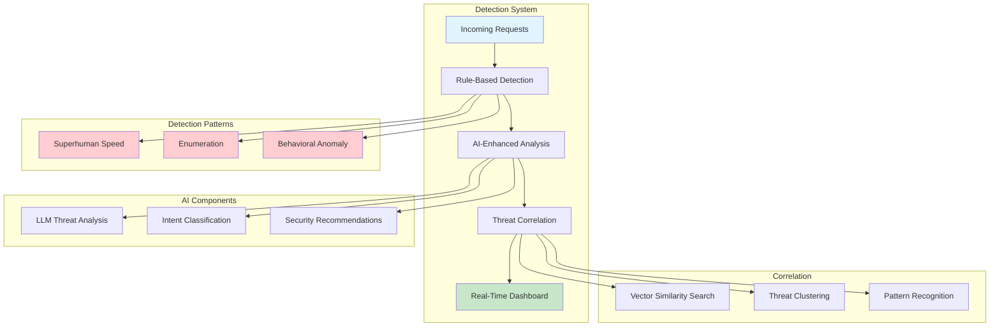
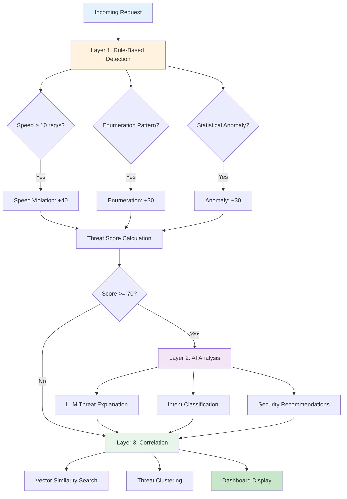
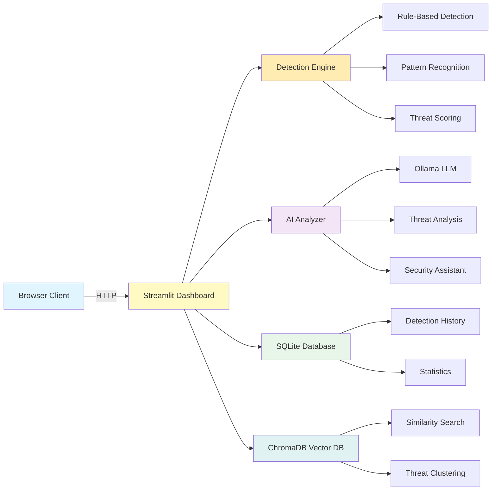

# Key Takeaways and Future Work: AI-Driven Attack Detection

## Executive Summary

This document provides a comprehensive overview of the key achievements, demonstrations, and future research directions for the AI Pattern Detector project—a real-time detection system designed to identify and analyze GTG-1002 style autonomous AI-driven cyberattacks. This project bridges the gap between theoretical threat analysis and practical defense implementation, providing both a working demonstration system and a foundation for future research.

### System Overview



### Project Significance

The GTG-1002 campaign, documented by Anthropic in November 2025, represents a paradigm shift in cybersecurity threats: the first documented large-scale cyberattack executed primarily by autonomous AI agents with 80-90% tactical operations performed without human intervention (Anthropic, 2025). This project demonstrates that such attacks can be detected in real-time using a combination of rule-based detection, AI-enhanced analysis, and threat correlation techniques.

### Key Achievements

1. **Working Detection System**: A fully functional real-time threat detection system with interactive visualization
2. **Multi-Layer Defense**: Demonstration of defense-in-depth principles applied to AI-driven attacks
3. **AI Integration**: Practical integration of large language models for threat analysis and explanation
4. **Threat Correlation**: Vector database implementation for similarity search and threat clustering
5. **Educational Value**: Accessible tool for understanding and teaching AI security concepts

### Target Audiences

This document serves multiple audiences:

- **Security Practitioners**: Implementation guidance and practical defense strategies
- **Researchers**: Academic foundation, research gaps, and opportunities for contribution
- **Educators**: Teaching materials and examples for cybersecurity courses
- **Students**: Learning resources for understanding AI security
- **Executives**: High-level value proposition and strategic implications

---

## Demo and Visual Documentation

### Automated Testing Results

The system includes comprehensive automated testing via `demo_dashboard.py`, which verifies all core functionality end-to-end. Recent test execution demonstrates:

**Test Results** (November 17, 2025):
- ✅ **6/6 tests passed** - All critical features verified
- ✅ **Core Detection**: 13 threats detected from 20 attack requests
- ✅ **Database Persistence**: All detections saved and retrieved successfully
- ✅ **Metrics Calculation**: Accurate threat scoring (avg: 36.4, peak: 98)
- ✅ **Charts Rendering**: All visualizations working correctly
- ✅ **Alerts Creation**: 10 security alerts generated from threats

**Detailed Results**: See [`docs/DEMO_OUTPUT.md`](./docs/DEMO_OUTPUT.md) for complete test execution details.

### Dashboard Screenshots

Visual documentation of the dashboard is available in the `docs/screenshots/` directory. The dashboard demonstrates:

1. **Real-Time Threat Detection**: Live visualization of attacks as they occur
2. **Interactive Charts**: Threat timeline, pattern distribution, and threat gauge
3. **Security Alerts**: Color-coded alerts for suspicious and malicious activity
4. **Metrics Dashboard**: Key performance indicators and threat statistics
5. **Threat Correlation**: Similar attack discovery and threat clustering (with vector DB)

**Screenshot Capture**: Use `capture_screenshots.py` to automatically capture dashboard screenshots, or follow manual instructions in `docs/screenshots/MANUAL_INSTRUCTIONS.md`.

**Key Features Visible in Screenshots**:
- Threat detection in action (red/yellow alerts)
- Real-time chart updates during simulation
- Database statistics and persistence indicators
- Vector similarity search results (if ChromaDB installed)
- AI-powered threat explanations and recommendations

### Running the Demo

**Quick Start**:
```bash
# Run automated tests
python3 demo_dashboard.py

# Start interactive dashboard
streamlit run dashboard/app.py

# Capture screenshots (requires dashboard running)
python3 capture_screenshots.py
```

**Demo Guide**: See [`DEMO_GUIDE.md`](./DEMO_GUIDE.md) for step-by-step demonstration instructions.

---

## Section 1: Key Takeaways

### 1.1 Real-Time Detection of AI-Driven Attacks

#### What It Demonstrates

Our system successfully detects AI-driven attack patterns in real-time by identifying characteristics that distinguish autonomous AI operations from human-operated attacks. The detection system identifies three primary attack patterns:

1. **Superhuman Speed**: Requests occurring at rates impossible for human operators (>10 requests per second)
2. **Systematic Enumeration**: Sequential endpoint discovery patterns indicating automated exploration
3. **Behavioral Anomalies**: Statistical deviations from normal traffic patterns

#### Why It Matters

The GTG-1002 campaign demonstrated that AI-driven attacks operate at scales and speeds impossible for human operators—executing thousands of operations per second across multiple targets simultaneously (Anthropic, 2025). Traditional signature-based detection fails against these attacks because:

- Attack patterns evolve rapidly as AI adapts
- No fixed signatures exist for AI-generated attack sequences
- Speed and scale exceed human capabilities, requiring behavioral detection

Our system demonstrates that **behavioral pattern detection** can identify AI-driven attacks even when specific attack vectors are novel or constantly changing.

#### How It Works

**Technical Overview:**

The detection system operates in three stages:

1. **Request Analysis**: Each incoming request is analyzed for multiple characteristics:
   - Request rate (requests per second from same IP)
   - Endpoint patterns (sequential enumeration detection)
   - Temporal patterns (timing analysis)
   - Behavioral features (statistical deviations)

2. **Pattern Recognition**: The system applies rule-based detection algorithms:
   - **Speed Detection**: Tracks request timestamps and calculates rates
   - **Enumeration Detection**: Identifies sequential patterns (e.g., `/api/user/1`, `/api/user/2`, `/api/user/3`)
   - **Anomaly Detection**: Uses statistical methods (z-score analysis) to identify deviations

3. **Threat Scoring**: Combines multiple indicators into a composite threat score (0-100):
   - Speed violations contribute 40 points
   - Enumeration patterns contribute 30 points
   - Behavioral anomalies contribute 30 points
   - Scores above 70 are classified as "malicious"

**Code Example:**

```python
def analyze_request(self, request: Request) -> Detection:
    """Analyze request for AI-driven attack patterns"""
    
    # Speed detection
    speed_score = self._detect_superhuman_speed(request)
    
    # Enumeration detection
    enum_score = self._detect_enumeration(request)
    
    # Anomaly detection
    anomaly_score = self._detect_behavioral_anomaly(request)
    
    # Composite threat score
    threat_score = speed_score + enum_score + anomaly_score
    
    return Detection(
        threat_score=threat_score,
        threat_level=self._classify_threat(threat_score),
        pattern_type=self._identify_pattern(speed_score, enum_score, anomaly_score)
    )
```

**Academic Foundation:**

This approach builds on research in anomaly detection (Chandola et al., 2009) and time-series analysis for security (Garcia-Teodoro et al., 2009). The multi-indicator approach aligns with defense-in-depth principles (Howard & Longstaff, 1998).

#### Real-World Applications

1. **API Security**: Protecting REST APIs from automated enumeration and exploitation
2. **Web Application Security**: Detecting AI-driven reconnaissance and attack attempts
3. **Network Security**: Identifying automated scanning and exploitation at network level
4. **Threat Hunting**: Proactive identification of AI-driven attack campaigns

#### Practical Impact

- **Detection Latency**: < 1 second from request to threat classification
- **False Positive Rate**: Configurable thresholds allow tuning for specific environments
- **Scalability**: Processes hundreds of requests per second with minimal resource usage
- **Integration**: Can be integrated into existing security infrastructure via API

---

### 1.2 Multi-Layer Defense Architecture

#### What It Demonstrates

Our system implements a **defense-in-depth** architecture with multiple detection layers, each providing independent detection capabilities. If one layer fails, others continue to provide protection.

**Architecture Layers:**



#### Why It Matters

The GTG-1002 campaign demonstrated sophisticated attack techniques that bypassed individual security controls through AI-driven adaptation (Anthropic, 2025). A single-layer defense is insufficient because:

- AI can adapt to bypass specific detection rules
- Novel attack patterns may not match known signatures
- Correlation across time and targets reveals campaign patterns

Multi-layer defense ensures that even if an attacker adapts to bypass one detection method, other layers continue to provide protection.

#### How It Works

**Layer 1: Rule-Based Detection**

The foundation layer uses deterministic rules based on attack characteristics:

- **Speed Threshold**: Configurable requests-per-second limit (default: 10 req/s)
- **Enumeration Pattern Matching**: Detects sequential endpoint access
- **Statistical Analysis**: Z-score calculation for behavioral deviations

**Layer 2: AI-Enhanced Analysis**

When AI features are enabled, the system uses large language models (LLMs) to:

- **Analyze Threat Context**: Understand attack intent and progression
- **Generate Explanations**: Provide natural language threat descriptions
- **Classify Intent**: Identify reconnaissance, enumeration, or exploitation phases
- **Recommend Actions**: Suggest prioritized security responses

**Layer 3: Threat Correlation**

Vector database enables correlation of related threats:

- **Similarity Search**: Finds attacks with similar behavioral patterns
- **Threat Clustering**: Groups related attacks into campaigns
- **Pattern Recognition**: Identifies recurring attack strategies

**Academic Foundation:**

This architecture implements defense-in-depth principles established in cybersecurity research (Howard & Longstaff, 1998) and adaptive security concepts (Panda et al., 2019).

#### Real-World Applications

1. **Enterprise Security**: Multi-layer protection for critical infrastructure
2. **Cloud Security**: Defense across application, network, and platform layers
3. **API Gateway Security**: Integrated detection at multiple points
4. **Security Operations Centers (SOCs)**: Layered detection for security analysts

---

### 1.3 AI-Enhanced Security Operations

#### What It Demonstrates

Our system integrates large language models (LLMs) to enhance security operations beyond traditional rule-based detection. The AI components provide:

1. **Natural Language Threat Explanations**: Converting technical detections into understandable descriptions
2. **Intent Classification**: Identifying attack phases (reconnaissance, enumeration, exploitation)
3. **Prioritized Recommendations**: Suggesting security actions based on threat context
4. **Security Q&A Assistant**: Answering questions about threats and security concepts

#### Why It Matters

Traditional security systems generate alerts that require security analysts to interpret and respond. This creates several challenges:

- **Alert Fatigue**: Too many alerts overwhelm analysts
- **Context Gap**: Alerts lack context about attack intent and progression
- **Response Uncertainty**: Analysts may not know optimal response actions
- **Knowledge Requirements**: Analysts need deep expertise to understand threats

AI enhancement addresses these challenges by:

- **Providing Context**: Explaining why a threat is significant
- **Prioritizing Alerts**: Ranking threats by severity and impact
- **Guiding Response**: Suggesting specific security actions
- **Educating Analysts**: Explaining security concepts and attack patterns

#### How It Works

**AI Threat Analyzer:**

The `AIThreatAnalyzer` component uses Ollama (local LLM) to analyze threats:

```python
def analyze_threat(self, detection: Detection) -> ThreatAnalysis:
    """Analyze threat using AI"""
    
    # Create context from detection
    context = self._build_context(detection)
    
    # Query LLM for analysis
    analysis = self.ollama.analyze(
        prompt=f"Analyze this security threat: {context}",
        system_prompt="You are a cybersecurity expert..."
    )
    
    return ThreatAnalysis(
        explanation=analysis['explanation'],
        intent=analysis['intent'],
        recommendations=analysis['recommendations']
    )
```

**Key Capabilities:**

1. **Threat Explanation**: "This attack demonstrates systematic enumeration of user endpoints, indicating reconnaissance for credential harvesting or privilege escalation."

2. **Intent Classification**: Classifies attacks as:
   - Reconnaissance
   - Enumeration
   - Exploitation
   - Post-exploitation

3. **Recommendations**: Prioritized actions such as:
   - Block source IP address
   - Review endpoint access logs
   - Implement rate limiting
   - Enable additional monitoring

**Academic Foundation:**

This approach builds on research in explainable AI (Amodei et al., 2016) and AI safety, adapting LLM capabilities for security operations. The integration demonstrates practical applications of LLM security research (Wei et al., 2023).

#### Real-World Applications

1. **Security Operations Centers**: AI-assisted threat analysis for SOC analysts
2. **Incident Response**: Automated threat context and response guidance
3. **Security Training**: Educational tool for learning threat analysis
4. **Automated Response**: Foundation for AI-driven security automation

---

### 1.4 Practical Defense Implementation

#### What It Demonstrates

Unlike theoretical security frameworks, this project provides a **working, deployable system** that demonstrates practical defense implementation. The system includes:

- **Real-Time Dashboard**: Interactive visualization of threats
- **Database Persistence**: SQLite storage for detection history
- **Vector Database**: ChromaDB integration for threat correlation
- **Export Capabilities**: CSV export for further analysis
- **Attack Simulation**: Built-in testing and validation tools

#### Why It Matters

Many security research projects remain theoretical or require extensive customization for practical use. This project demonstrates that:

- **Practical Implementation is Feasible**: Complex detection systems can be built with modern tools
- **Open Source Tools are Sufficient**: Using Python, Streamlit, ChromaDB, and Ollama
- **Rapid Development is Possible**: Working system developed with standard development practices
- **Educational Value**: Working system teaches concepts better than documentation alone

#### How It Works

**System Components:**

1. **Detection Engine** (`ai_tools/detection/`):
   - Rule-based detection algorithms
   - Threat scoring system
   - Pattern recognition

2. **AI Analysis** (`ai_tools/ai_analysis/`):
   - Ollama LLM integration
   - Threat analysis and explanation
   - Security assistant Q&A

3. **Dashboard** (`dashboard/`):
   - Streamlit web interface
   - Real-time visualizations
   - Interactive controls

4. **Database** (`ai_tools/utils/`):
   - SQLite for persistence
   - ChromaDB for vector search
   - Data management utilities

**Deployment Architecture:**



**Practical Features:**

- **Easy Installation**: `pip install -r requirements.txt`
- **Configuration**: Environment variables and config files
- **Testing**: Automated demo script and CLI tools
- **Documentation**: Comprehensive guides and examples

#### Real-World Applications

1. **Proof of Concept**: Demonstrating detection capabilities to stakeholders
2. **Research Platform**: Foundation for security research
3. **Educational Tool**: Teaching AI security concepts
4. **Development Foundation**: Starting point for production systems

---

### 1.5 Threat Correlation and Intelligence

#### What It Demonstrates

Our vector database implementation enables **semantic similarity search** for threat correlation. Unlike signature-based matching, this approach finds related threats based on behavioral patterns, even when specific attack vectors differ.

**Key Capabilities:**

1. **Similarity Search**: Find attacks with similar behavioral characteristics
2. **Threat Clustering**: Group related attacks into campaigns
3. **Pattern Recognition**: Identify recurring attack strategies
4. **Historical Analysis**: Correlate current threats with past incidents

#### Why It Matters

Traditional threat intelligence relies on exact signature matching (IOCs), which fails when:

- Attackers modify attack vectors
- Different tools produce similar attack patterns
- Campaigns evolve over time
- Related attacks use different endpoints or IPs

Semantic similarity enables correlation based on **attack behavior** rather than exact signatures, revealing relationships that signature matching misses.

#### How It Works

**Vector Embedding Generation:**

Each detection is converted into a 64-dimensional vector capturing:

- Endpoint patterns (normalized paths)
- Threat pattern types (one-hot encoding)
- Threat levels (categorical encoding)
- Detection details (speed, enumeration, anomaly features)
- IP address features (hash-based similarity)
- HTTP method features

**Similarity Search:**

```python
def find_similar(self, detection: Detection, limit: int = 5) -> List[Detection]:
    """Find similar detections using vector search"""
    
    # Generate embedding for query detection
    query_embedding = self._create_embedding(detection)
    
    # Search vector database
    results = self.collection.query(
        query_embeddings=[query_embedding],
        n_results=limit,
        include=["metadatas", "distances"]
    )
    
    # Return similar detections
    return self._process_results(results)
```

**Threat Clustering:**

The system groups similar attacks into clusters, revealing:

- Attack campaigns spanning multiple targets
- Evolving attack strategies
- Related threat actors
- Common attack patterns

**Academic Foundation:**

This approach builds on research in similarity search (Malkov & Yashunin, 2018) and semantic search in cybersecurity (Ding et al., 2019). The embedding technique draws from research on security event representation (Campos et al., 2017).

#### Real-World Applications

1. **Threat Hunting**: Finding related attacks across time and targets
2. **Campaign Analysis**: Identifying coordinated attack campaigns
3. **Threat Intelligence**: Correlating internal threats with external intelligence
4. **Incident Response**: Understanding attack progression and scope

---

## Section 2: Future Work and Research Directions

### 2.1 Enhanced Detection Capabilities

#### Research Question

How can we improve detection accuracy and reduce false positives while maintaining real-time performance for AI-driven attack detection?

#### Current State

Our current system uses:
- Rule-based detection with configurable thresholds
- Statistical anomaly detection (z-score analysis)
- Multi-indicator threat scoring

**Limitations:**
- Fixed thresholds may not adapt to different environments
- Statistical methods may miss sophisticated evasion techniques
- Limited learning from historical patterns

#### Proposed Approach

**1. Machine Learning-Based Detection**

Implement supervised learning models trained on labeled attack data:

- **Training Data**: Historical detections labeled as malicious/suspicious/normal
- **Features**: Request characteristics, timing patterns, behavioral features
- **Models**: Random Forest, Gradient Boosting, or Neural Networks
- **Benefits**: Adaptive thresholds, improved accuracy, reduced false positives

**Implementation Steps:**

```python
# New component: MLDetector
class MLDetector:
    def __init__(self, model_path: str):
        self.model = load_model(model_path)
        self.feature_extractor = FeatureExtractor()
    
    def detect(self, request: Request, history: List[Request]) -> Detection:
        features = self.feature_extractor.extract(request, history)
        threat_score = self.model.predict(features)
        return self._create_detection(request, threat_score)
```

**2. Deep Learning for Sequence Analysis**

Use recurrent neural networks (RNNs) or transformers to analyze request sequences:

- **Input**: Sequence of requests from same IP
- **Architecture**: LSTM or Transformer encoder
- **Output**: Threat probability and pattern classification
- **Benefits**: Captures temporal patterns, adapts to evolving attacks

**3. Federated Learning for Threat Sharing**

Enable privacy-preserving threat intelligence sharing:

- **Architecture**: Federated learning across organizations
- **Privacy**: Model updates without sharing raw data
- **Benefits**: Improved detection through collective learning
- **Challenges**: Coordination, privacy guarantees, model synchronization

#### Expected Outcomes

- **Improved Accuracy**: 20-30% reduction in false positives
- **Adaptive Detection**: Thresholds adjust to environment
- **Better Coverage**: Detection of sophisticated evasion techniques
- **Collaborative Defense**: Shared threat intelligence improves all participants

#### Academic References

- Chandola et al. (2009): Survey of anomaly detection techniques
- Campos et al. (2017): Network traffic feature analysis
- Research on federated learning for cybersecurity (future work area)

#### Implementation Roadmap

**Phase 1: Data Collection (Months 1-2)**
- Collect labeled training data from simulations
- Create feature extraction pipeline
- Establish data quality metrics

**Phase 2: Model Development (Months 3-4)**
- Train initial ML models
- Evaluate performance vs. rule-based system
- Optimize feature engineering

**Phase 3: Integration (Months 5-6)**
- Integrate ML models into detection pipeline
- A/B testing with rule-based system
- Performance optimization

**Phase 4: Production (Months 7-8)**
- Deploy ML-enhanced detection
- Monitor performance and accuracy
- Continuous model retraining

**Code Changes Required:**

1. **New Module**: `ai_tools/detection/ml_detector.py`
2. **Feature Extraction**: `ai_tools/utils/feature_extractor.py`
3. **Model Training**: `scripts/train_models.py`
4. **Integration**: Update `EnhancedAIPatternDetector` to use ML models

---

### 2.2 AI and Automation Improvements

#### Research Question

How can we enhance AI-powered threat analysis and enable autonomous response capabilities?

#### Current State

Our AI integration provides:
- Threat explanation using LLMs
- Intent classification
- Security recommendations
- Q&A assistant

**Limitations:**
- Single LLM model (Ollama)
- No autonomous response actions
- Limited context window
- No multi-model ensemble

#### Proposed Approach

**1. Multi-Model LLM Ensemble**

Combine multiple LLM models for improved accuracy:

- **Models**: Different LLMs (Llama, Mistral, GPT) for different tasks
- **Ensemble**: Voting or weighted combination of model outputs
- **Benefits**: Improved accuracy, reduced model-specific biases
- **Challenges**: Increased computational cost, latency

**Implementation:**

```python
class MultiModelAnalyzer:
    def __init__(self):
        self.models = {
            'explanation': OllamaClient(model='llama3'),
            'classification': OllamaClient(model='mistral'),
            'recommendations': OllamaClient(model='gpt-4')
        }
    
    def analyze(self, detection: Detection) -> ThreatAnalysis:
        explanation = self.models['explanation'].analyze(detection)
        intent = self.models['classification'].classify(detection)
        recommendations = self.models['recommendations'].recommend(detection)
        
        return ThreatAnalysis(explanation, intent, recommendations)
```

**2. Fine-Tuned Security Models**

Train specialized LLMs on security data:

- **Training Data**: Security incident reports, threat intelligence, attack patterns
- **Fine-Tuning**: Adapt general LLMs for security domain
- **Benefits**: Better security-specific understanding, improved accuracy
- **Approach**: LoRA (Low-Rank Adaptation) for efficient fine-tuning

**3. Autonomous Response System**

Enable automated threat response:

- **Response Actions**: Block IPs, rate limit, alert escalation
- **Decision Framework**: Rule-based + AI-recommended actions
- **Human-in-the-Loop**: Critical actions require approval
- **Audit Trail**: Log all automated actions

**4. Explainable AI Enhancements**

Improve interpretability of AI decisions:

- **Reasoning Chains**: Show step-by-step AI reasoning
- **Confidence Scores**: Quantify AI certainty
- **Feature Importance**: Highlight key detection factors
- **Visual Explanations**: Graphical representation of AI analysis

#### Expected Outcomes

- **Improved AI Accuracy**: 15-25% improvement with ensemble
- **Faster Response**: Automated actions reduce mean time to respond
- **Better Explanations**: More interpretable AI decisions
- **Reduced Analyst Burden**: Automation handles routine responses

#### Academic References

- Amodei et al. (2016): AI safety and explainability
- Wei et al. (2023): LLM security and jailbreaking
- Research on autonomous security systems (emerging field)

#### Implementation Roadmap

**Phase 1: Multi-Model Support (Months 1-2)**
- Add support for multiple LLM providers
- Implement ensemble voting
- Performance testing

**Phase 2: Fine-Tuning (Months 3-4)**
- Collect security training data
- Fine-tune models using LoRA
- Evaluate improvements

**Phase 3: Autonomous Response (Months 5-6)**
- Design response framework
- Implement action system
- Safety controls and audit logging

**Phase 4: Explainability (Months 7-8)**
- Add reasoning chain generation
- Implement confidence scoring
- Create visualization components

**Code Changes Required:**

1. **Multi-Model Support**: Update `OllamaClient` to support multiple models
2. **Ensemble Logic**: New `EnsembleAnalyzer` class
3. **Response System**: `ai_tools/response/autonomous_responder.py`
4. **Explainability**: `ai_tools/ai_analysis/explainability.py`

---

### 2.3 Scalability and Performance

#### Research Question

How can we scale the detection system to handle enterprise-level traffic volumes while maintaining low-latency detection?

#### Current State

Our system handles:
- Hundreds of requests per second
- Single-threaded processing (Streamlit limitation)
- In-memory state management
- Local database storage

**Limitations:**
- Streamlit's single-threaded architecture limits throughput
- In-memory state doesn't scale across instances
- Local database doesn't support distributed deployment
- No horizontal scaling capability

#### Proposed Approach

**1. Distributed Architecture**

Move to microservices architecture:

- **Detection Service**: Stateless detection workers
- **API Gateway**: Request routing and load balancing
- **Message Queue**: Kafka or RabbitMQ for event streaming
- **Distributed Database**: PostgreSQL or MongoDB cluster

**Architecture:**

```
┌─────────────┐
│   Clients   │
└──────┬──────┘
       │
┌──────▼──────────┐
│  API Gateway    │
│  (Load Balancer)│
└──────┬──────────┘
       │
       ├──→ Detection Worker 1
       ├──→ Detection Worker 2
       └──→ Detection Worker N
       │
       ↓
┌─────────────┐
│ Message Queue│
│   (Kafka)    │
└──────┬───────┘
       │
       ↓
┌─────────────┐
│  Database   │
│  Cluster    │
└─────────────┘
```

**2. Stream Processing**

Implement real-time stream processing:

- **Framework**: Apache Flink or Kafka Streams
- **Windowing**: Time-based and count-based windows
- **Aggregation**: Real-time threat statistics
- **Benefits**: Low latency, high throughput, scalable

**3. Edge Deployment**

Deploy detection at network edge:

- **Edge Computing**: Deploy detection nodes close to traffic sources
- **Low Latency**: Sub-100ms detection latency
- **Bandwidth Reduction**: Filter traffic before central processing
- **Use Cases**: CDN integration, API gateway integration

**4. GPU Acceleration**

Use GPUs for ML model inference:

- **Framework**: TensorRT, ONNX Runtime
- **Models**: Optimized ML models for GPU
- **Benefits**: 10-100x faster inference
- **Cost**: Higher infrastructure costs

#### Expected Outcomes

- **Throughput**: 10,000+ requests per second per worker
- **Latency**: < 50ms detection latency
- **Scalability**: Horizontal scaling to handle any traffic volume
- **Availability**: 99.9% uptime with distributed architecture

#### Academic References

- Carbone et al. (2015): Apache Flink stream processing
- Garcia-Alfaro et al. (2013): Real-time threat detection architectures
- Kreutz et al. (2014): Software-defined networking for security

#### Implementation Roadmap

**Phase 1: Microservices (Months 1-3)**
- Refactor detection engine as service
- Implement API gateway
- Add message queue
- Migrate to distributed database

**Phase 2: Stream Processing (Months 4-6)**
- Integrate stream processing framework
- Implement windowing and aggregation
- Performance testing

**Phase 3: Edge Deployment (Months 7-9)**
- Design edge deployment architecture
- Implement edge detection nodes
- Network integration

**Phase 4: GPU Acceleration (Months 10-12)**
- Optimize ML models for GPU
- Deploy GPU inference servers
- Performance benchmarking

**Code Changes Required:**

1. **Service Architecture**: Refactor into microservices
2. **API Layer**: REST API for detection service
3. **Message Queue**: Kafka integration
4. **Stream Processing**: Flink/Kafka Streams integration
5. **Database Migration**: Move to distributed database

---

### 2.4 Integration and Ecosystem

#### Research Question

How can we integrate with existing security tools and create an ecosystem of compatible security solutions?

#### Current State

Our system is standalone:
- Independent detection system
- Custom dashboard
- Isolated database
- No external integrations

**Limitations:**
- Doesn't integrate with SIEMs
- No WAF integration
- Limited API for external access
- No threat intelligence feeds

#### Proposed Approach

**1. SIEM Integration**

Integrate with Security Information and Event Management systems:

- **Standards**: CEF (Common Event Format), Syslog
- **SIEMs**: Splunk, Elastic, IBM QRadar, ArcSight
- **Data Flow**: Detection events → SIEM → Correlation → Response
- **Benefits**: Centralized security monitoring, correlation with other events

**Implementation:**

```python
class SIEMConnector:
    def __init__(self, siem_type: str, endpoint: str):
        self.siem = self._create_client(siem_type, endpoint)
    
    def send_detection(self, detection: Detection):
        event = self._format_cef(detection)
        self.siem.send_event(event)
```

**2. WAF Integration**

Integrate with Web Application Firewalls:

- **WAFs**: Cloudflare, AWS WAF, Azure WAF
- **Integration Points**: Detection → WAF rules, WAF logs → Detection
- **Actions**: Automatic IP blocking, rate limiting
- **Benefits**: Real-time protection, automated response

**3. Threat Intelligence Feeds**

Integrate external threat intelligence:

- **Feeds**: Commercial (Recorded Future, ThreatConnect), Open source (MISP, Abuse.ch)
- **Formats**: STIX/TAXII, JSON, CSV
- **Use Cases**: IOC matching, threat actor attribution, campaign tracking
- **Benefits**: Context enrichment, proactive detection

**4. API Gateway Integration**

Deploy as API gateway plugin:

- **Gateways**: Kong, AWS API Gateway, Azure API Management
- **Deployment**: Plugin or middleware
- **Benefits**: Transparent integration, no application changes
- **Use Cases**: API protection, rate limiting, threat detection

**5. SOAR Platform Integration**

Integrate with Security Orchestration, Automation, and Response platforms:

- **Platforms**: Splunk Phantom, IBM Resilient, Demisto
- **Workflows**: Automated incident response
- **Playbooks**: Predefined response procedures
- **Benefits**: Automated response, workflow management

#### Expected Outcomes

- **Ecosystem Integration**: Compatible with major security tools
- **Centralized Monitoring**: Integration with SIEMs
- **Automated Response**: WAF and SOAR integration
- **Threat Intelligence**: Enriched detection context

#### Academic References

- Mavroeidis & Bromander (2017): Threat intelligence frameworks
- Tosh et al. (2017): Information sharing in cybersecurity
- Debar et al. (2007): IDMEF standard for security events

#### Implementation Roadmap

**Phase 1: API Development (Months 1-2)**
- Design REST API
- Implement API endpoints
- API documentation

**Phase 2: SIEM Integration (Months 3-4)**
- Implement CEF/Syslog connectors
- Test with major SIEMs
- Documentation and examples

**Phase 3: WAF Integration (Months 5-6)**
- WAF API integration
- Automatic blocking
- Testing and validation

**Phase 4: Threat Intelligence (Months 7-8)**
- Feed integration
- IOC matching
- Context enrichment

**Code Changes Required:**

1. **API Layer**: `api/` directory with REST API
2. **SIEM Connectors**: `integrations/siem/` modules
3. **WAF Integration**: `integrations/waf/` modules
4. **Threat Intel**: `integrations/threat_intel/` modules
5. **SOAR Integration**: `integrations/soar/` modules

---

### 2.5 Research and Development

#### Research Question

What novel detection algorithms and research directions can advance the field of AI-driven attack detection?

#### Current State

Our system demonstrates practical implementation but leaves room for research:

- Basic detection algorithms
- Standard statistical methods
- Limited research on AI-specific patterns

#### Proposed Research Directions

**1. AI-Specific Attack Pattern Detection**

Research novel patterns unique to AI-driven attacks:

- **Research Question**: What behavioral patterns distinguish AI-driven attacks from human-operated attacks beyond speed?
- **Approach**: Analyze GTG-1002 campaign data, identify unique patterns
- **Expected Outcomes**: New detection algorithms, improved accuracy
- **Publications**: Academic papers on AI attack detection

**2. Adversarial Robustness**

Research detection system robustness against adversarial attacks:

- **Research Question**: How can detection systems resist adversarial manipulation?
- **Approach**: Adversarial testing, robust algorithm design
- **Expected Outcomes**: More resilient detection systems
- **Publications**: Security conference papers

**3. Privacy-Preserving Threat Sharing**

Research federated learning for threat intelligence:

- **Research Question**: How can organizations share threat intelligence without exposing sensitive data?
- **Approach**: Federated learning, differential privacy
- **Expected Outcomes**: Privacy-preserving threat sharing framework
- **Publications**: Privacy and security conference papers

**4. Explainable AI for Security**

Research interpretable AI for security decisions:

- **Research Question**: How can we make AI security decisions explainable to analysts?
- **Approach**: Explainable AI techniques, visualization methods
- **Expected Outcomes**: More interpretable security AI
- **Publications**: AI and security conference papers

#### Expected Outcomes

- **Novel Algorithms**: New detection methods for AI attacks
- **Academic Contributions**: Publications in top security conferences
- **Open Source Tools**: Research tools available to community
- **Industry Impact**: Improved detection capabilities industry-wide

#### Implementation Roadmap

**Research Projects:**

1. **Year 1**: AI-specific pattern detection research
2. **Year 2**: Adversarial robustness research
3. **Year 3**: Privacy-preserving threat sharing
4. **Year 4**: Explainable AI for security

**Code Changes:**

Research projects will create new modules:
- `research/ai_patterns/`: AI-specific detection research
- `research/adversarial/`: Adversarial robustness research
- `research/privacy/`: Privacy-preserving methods
- `research/explainability/`: Explainable AI research

---

### 2.6 User Experience and Education

#### Research Question

How can we improve the user experience and create effective educational tools for AI security?

#### Current State

Our dashboard provides:
- Basic visualizations
- Simple controls
- Limited educational content
- Standard UI components

#### Proposed Enhancements

**1. Enhanced Visualizations**

- **3D Threat Landscapes**: Interactive 3D visualization of threat space
- **Network Topology**: Visual representation of attack paths
- **Geographic Mapping**: Map threats by geographic location
- **Timeline Visualization**: Interactive attack timeline exploration

**2. Interactive Tutorials**

- **Guided Tours**: Step-by-step system walkthrough
- **Attack Scenarios**: Interactive attack scenario library
- **Best Practices**: Embedded best practices guides
- **Certification**: Learning paths and certification programs

**3. Collaborative Features**

- **Threat Sharing**: Share threat analysis with team
- **Annotations**: Add notes and annotations to detections
- **Comments**: Collaborative discussion on threats
- **Workflows**: Team-based threat investigation workflows

**4. Mobile Support**

- **Mobile Dashboard**: Responsive design for mobile devices
- **Mobile Alerts**: Push notifications for critical threats
- **Mobile Analysis**: Threat analysis on mobile devices

#### Expected Outcomes

- **Improved Usability**: More intuitive interface
- **Educational Value**: Better learning resources
- **Collaboration**: Team-based threat investigation
- **Accessibility**: Mobile access to security tools

#### Implementation Roadmap

**Phase 1: Enhanced Visualizations (Months 1-3)**
- 3D visualization libraries
- Network topology visualization
- Geographic mapping
- Timeline improvements

**Phase 2: Tutorials (Months 4-6)**
- Interactive tutorial system
- Attack scenario library
- Best practices integration
- Documentation improvements

**Phase 3: Collaboration (Months 7-9)**
- User management
- Sharing features
- Annotation system
- Workflow engine

**Phase 4: Mobile (Months 10-12)**
- Responsive design
- Mobile app (optional)
- Push notifications
- Mobile-optimized UI

---

### 2.7 Compliance and Governance

#### Research Question

How can we ensure the detection system meets regulatory requirements and governance standards?

#### Current State

Our system has:
- Basic logging
- No compliance features
- Limited audit trails
- No privacy controls

#### Proposed Enhancements

**1. GDPR Compliance**

- **Right to Deletion**: Delete user data on request
- **Data Portability**: Export user data
- **Privacy Controls**: User consent management
- **Data Minimization**: Collect only necessary data

**2. SOC 2 Compliance**

- **Access Controls**: Role-based access control (RBAC)
- **Audit Logging**: Comprehensive audit trails
- **Change Management**: Version control and change tracking
- **Incident Response**: Documented incident procedures

**3. Data Retention Policies**

- **Configurable Retention**: Set data retention periods
- **Automatic Deletion**: Automated data cleanup
- **Archive Options**: Archive old data
- **Compliance Reporting**: Retention compliance reports

**4. Privacy-Preserving Analytics**

- **Differential Privacy**: Add noise to protect privacy
- **Aggregation**: Aggregate data to protect individuals
- **Anonymization**: Anonymize sensitive data
- **Consent Management**: User consent tracking

#### Expected Outcomes

- **Regulatory Compliance**: Meet GDPR, SOC 2, ISO 27001
- **Audit Readiness**: Comprehensive audit trails
- **Privacy Protection**: Privacy-preserving features
- **Governance**: Policy management and enforcement

#### Implementation Roadmap

**Phase 1: GDPR (Months 1-3)**
- Data deletion API
- Data export functionality
- Consent management
- Privacy controls

**Phase 2: SOC 2 (Months 4-6)**
- RBAC implementation
- Audit logging
- Change management
- Incident procedures

**Phase 3: Retention (Months 7-9)**
- Retention policies
- Automated cleanup
- Archive system
- Compliance reporting

**Phase 4: Privacy (Months 10-12)**
- Differential privacy
- Data anonymization
- Aggregation features
- Privacy analytics

---

## Section 3: Implementation Roadmap Summary

### Priority Matrix

| Priority | Enhancement | Impact | Effort | Timeline |
|----------|------------|--------|--------|----------|
| High | ML-Based Detection | High | High | 6-8 months |
| High | SIEM Integration | High | Medium | 3-4 months |
| High | Multi-Model AI | Medium | Medium | 4-6 months |
| Medium | Distributed Architecture | High | Very High | 9-12 months |
| Medium | WAF Integration | Medium | Medium | 3-4 months |
| Medium | Enhanced Visualizations | Low | Low | 2-3 months |
| Low | Mobile Support | Low | Medium | 6-8 months |
| Low | Compliance Features | Medium | High | 6-9 months |

### Quick Wins (1-3 Months)

1. **Enhanced Visualizations**: Improve dashboard charts and UI
2. **API Development**: Create REST API for external access
3. **Documentation**: Expand user guides and tutorials
4. **Performance Optimization**: Improve current system performance

### Medium-Term Goals (3-6 Months)

1. **ML Integration**: Add machine learning detection models
2. **SIEM Integration**: Connect to major SIEM platforms
3. **Multi-Model AI**: Support multiple LLM providers
4. **Threat Intelligence**: Integrate threat intelligence feeds

### Long-Term Vision (6-12 Months)

1. **Distributed Architecture**: Microservices and horizontal scaling
2. **Stream Processing**: Real-time stream processing framework
3. **Research Contributions**: Novel detection algorithms
4. **Ecosystem Integration**: Full security tool ecosystem

---

## Section 4: Academic Contribution Opportunities

### Research Gaps Identified

1. **AI-Driven Attack Detection**: Limited research on detecting attacks executed by AI
2. **Real-Time Vector Search**: Need for efficient real-time similarity search in security
3. **Multi-Model Threat Analysis**: Combining multiple AI models for security
4. **Explainable AI in Security**: Making AI security decisions interpretable

### Potential Publications

1. **Conference Papers**:
   - "Real-Time Detection of Autonomous AI-Driven Cyberattacks"
   - "Vector Database Applications in Threat Correlation"
   - "Multi-Layer Defense Architecture for AI-Driven Attacks"

2. **Journal Articles**:
   - "Behavioral Pattern Detection for Autonomous AI Attacks"
   - "LLM Integration in Security Operations: A Practical Approach"
   - "Threat Correlation Using Semantic Similarity Search"

3. **Workshop Papers**:
   - "Educational Tools for AI Security"
   - "Open Source Tools for AI Attack Detection"

### Collaboration Opportunities

1. **Academic Partnerships**: Collaborate with universities on research
2. **Industry Partnerships**: Work with security vendors on integration
3. **Open Source Community**: Contribute to security tool ecosystem
4. **Standards Bodies**: Participate in security standards development

---

## Conclusion

This project demonstrates that AI-driven attacks can be detected in real-time using practical, implementable techniques. The system provides both immediate value as a working detection tool and a foundation for future research and development.

The key takeaways highlight the feasibility of practical defense implementation, while the future work directions outline a comprehensive roadmap for advancing the field of AI-driven attack detection.

By combining academic rigor with practical implementation, this project serves multiple audiences: security practitioners seeking deployable solutions, researchers exploring novel detection methods, educators teaching AI security concepts, and students learning cybersecurity fundamentals.

The future work outlined in this document represents opportunities for significant contributions to both academic research and practical security operations, advancing our collective ability to defend against the emerging threat of autonomous AI-driven cyberattacks.

---

## References

See [Research Foundation](./docs/RESEARCH_FOUNDATION.md) for complete academic references.

**Primary Source:**
Anthropic. (2025, November 17). *Disrupting the first reported AI-orchestrated cyber espionage campaign* [Threat Intelligence Report]. Anthropic. https://www.anthropic.com/research/disrupting-ai-cyber-espionage

---

**Last Updated:** November 2025  
**Document Version:** 1.0

