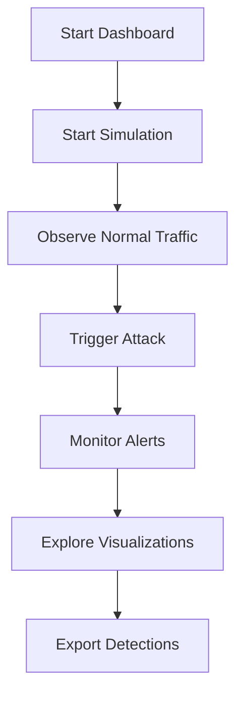

# Quick Start Guide: AI Pattern Detector

Get started with the AI Pattern Detector dashboard in 5 minutes!

## Prerequisites

- Python 3.8 or higher
- pip (Python package manager)

## Installation

### Option 1: Automated Setup (Recommended)

**Linux/macOS:**
```bash
chmod +x setup.sh
./setup.sh
```

**Windows:**
```cmd
setup.bat
```

The setup script will:
- ✅ Check Python version
- ✅ Create virtual environment (optional)
- ✅ Install all dependencies
- ✅ Verify installation
- ✅ Set up optional components

### Option 2: Using Make (Linux/macOS)

```bash
make setup
```

### Option 3: Manual Setup

```bash
# Create virtual environment (recommended)
python3 -m venv venv
source venv/bin/activate  # On Windows: venv\Scripts\activate

# Upgrade pip
pip install --upgrade pip

# Install dependencies
pip install -r ai_tools/requirements.txt
```

📖 **For detailed setup instructions**, see [SETUP_GUIDE.md](./SETUP_GUIDE.md)

## Running the Dashboard

```bash
streamlit run dashboard/app.py
```

The dashboard will open automatically in your browser at `http://localhost:8501`

## Quick Start Flow



## First Steps

1. **Start Simulation**: Click "Start Simulation" in the sidebar to begin generating traffic
2. **Observe Normal Traffic**: Watch the dashboard as normal traffic patterns are detected
3. **Trigger Attack**: Click "Trigger Attack" to simulate a GTG-1002 style attack
4. **Monitor Alerts**: Watch the alert feed and threat timeline as attacks are detected
5. **Explore Visualizations**: Review the threat gauge, pattern distribution, and detection table

## Understanding the Dashboard

### Metrics Panel
- **Total Detections**: Number of requests analyzed
- **Malicious Threats**: Count of high-threat detections
- **Avg Threat Score**: Average threat score (0-100)
- **Peak Threat Score**: Highest threat score detected

### Visualizations
- **Threat Timeline**: Shows threat scores over time with color coding
- **Threat Gauge**: Current threat level indicator
- **Pattern Distribution**: Breakdown of detected attack patterns

### Alert Feed
Real-time alerts showing:
- Superhuman speed detections
- Systematic enumeration patterns
- Behavioral anomalies

## Configuration

Adjust detection sensitivity in the sidebar:
- **Superhuman Speed Threshold**: Default 10 req/s (human max ~2-3 req/s)
- **Attack Intensity**: Control ratio of attack traffic (0.0 to 1.0)

## Troubleshooting

**Dashboard won't start:**
- Ensure all dependencies are installed: `pip install -r ai_tools/requirements.txt`
- Check Python version: `python3 --version` (need 3.8+)

**No detections appearing:**
- Click "Start Simulation" to begin traffic generation
- Click "Trigger Attack" to see attack detection in action

**Import errors:**
- Ensure you're running from the repository root directory
- Check that all files are present in `ai_tools/` and `dashboard/` directories

## Next Steps

- Read the [Dashboard README](./dashboard/README.md) for detailed usage
- Review the [AI Pattern Detector Guide](./docs/ai_pattern_detector_guide.md) for technical details
- Explore the [Threat Analysis](./Threat_Analysis_GTG-1002.md) for context

## Support

For issues or questions:
- Check the documentation in `docs/`
- Review the code comments
- Open an issue on GitHub

---

**Happy detecting! 🛡️**

