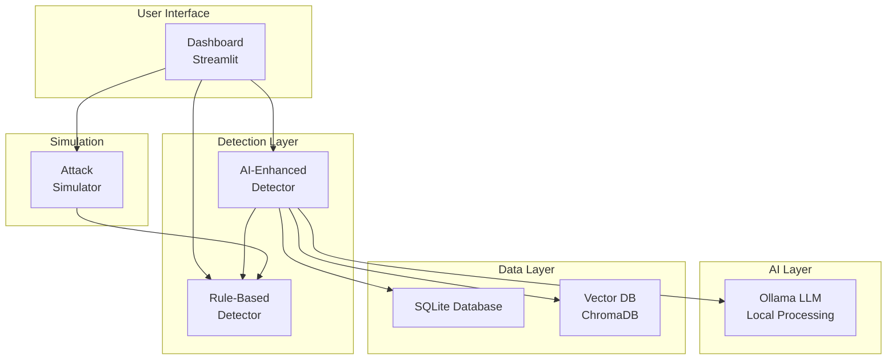

# AI-Driven Cyberattack Defense: GTG-1002 Threat Analysis

[](https://opensource.org/licenses/MIT)
[](https://www.python.org/downloads/)
[](https://github.com/khaosans/ai-cyberattack-defense/actions)

## 📖 About This Project

### Why This Repository Exists

In November 2025, Anthropic's Threat Intelligence team documented **GTG-1002**—the first large-scale, AI-orchestrated cyber espionage campaign (Anthropic, 2025). This event marked a paradigm shift in cybersecurity: AI agents executed 80-90% of attack operations autonomously, demonstrating capabilities that fundamentally challenge traditional defense strategies.

**This repository exists to:**

1. **Document and Analyze**: Provide comprehensive technical analysis of AI-driven attack patterns, methodologies, and characteristics observed in GTG-1002
2. **Enable Defense**: Offer practical detection tools and defense mechanisms specifically designed to identify and mitigate AI-orchestrated attacks
3. **Share Knowledge**: Create an open-source resource for security professionals, researchers, and organizations to understand and defend against this emerging threat class
4. **Advance Research**: Contribute to the cybersecurity community's understanding of AI-powered threats through documented case studies, research foundations, and implementation roadmaps

### The Threat Landscape Has Changed

Traditional security tools are designed to detect human-operated attacks with predictable patterns, timing, and behaviors. AI-driven attacks operate differently:

- **Superhuman Speed**: Thousands of operations per second, impossible for human operators
- **Systematic Enumeration**: Automated endpoint discovery at unprecedented scale
- **Behavioral Mimicry**: AI agents can mimic legitimate user behavior patterns
- **Autonomous Decision-Making**: 80-90% of operations executed without human intervention

This repository provides the tools and knowledge needed to detect, analyze, and defend against these next-generation threats.

### Who Is This For?

This project serves multiple audiences:

- **🔒 Security Professionals**: SOC analysts, incident responders, and security engineers seeking practical tools to detect AI-driven attacks
- **🎓 Researchers & Academics**: Those studying AI security, threat detection, and cybersecurity who need documented case studies and research foundations
- **👨‍🏫 Educators**: Instructors teaching cybersecurity, AI security, or threat analysis who want hands-on demonstration tools
- **📚 Students**: Learners exploring cybersecurity concepts, AI threats, and defensive strategies through practical examples
- **🏢 Organizations**: Security teams evaluating defense strategies against emerging AI-powered threats
- **🔧 Developers**: Engineers building security tools who need reference implementations and architectural patterns

### What Problems Does This Solve?

**Problem 1: Detection Gap**
- Traditional security tools miss AI-driven attacks that operate at superhuman speeds
- **Solution**: Real-time behavioral pattern detection specifically designed for AI attack characteristics

**Problem 2: Knowledge Gap**
- Limited understanding of how AI-driven attacks differ from traditional threats
- **Solution**: Comprehensive threat analysis, case studies, and documentation explaining GTG-1002 patterns

**Problem 3: Analysis Overload**
- Security teams overwhelmed by alerts without context or guidance
- **Solution**: AI-powered security assistant that explains threats and provides actionable recommendations

**Problem 4: Research Foundation**
- Academic research on AI-driven attacks lacks practical implementation examples
- **Solution**: Working demonstration system with documented architecture and research foundations

**Problem 5: Educational Resources**
- Limited hands-on tools for learning AI security concepts
- **Solution**: Interactive dashboard with attack simulation and visual threat analysis

### Key Use Cases

1. **Threat Detection Demonstration**
   - Run attack simulations to see AI-driven attack patterns in action
   - Visualize threat detection in real-time with interactive dashboards
   - Understand detection algorithms through practical examples

2. **Security Training & Education**
   - Use as a teaching tool for cybersecurity courses
   - Demonstrate AI attack characteristics vs. human-operated attacks
   - Practice threat analysis and incident response procedures

3. **Research & Development**
   - Foundation for academic research on AI-driven attack detection
   - Reference implementation for building production security systems
   - Testbed for evaluating new detection algorithms

4. **Proof of Concept**
   - Demonstrate detection capabilities to stakeholders
   - Evaluate defense strategies against AI-driven attacks
   - Validate security architecture decisions

5. **Threat Intelligence Analysis**
   - Analyze GTG-1002 campaign patterns and methodologies
   - Study documented case studies and threat intelligence
   - Understand AI attack characteristics and defense requirements

### What You'll Find Here

This repository contains a **demonstration defense system** including:

- **🔍 Real-time AI pattern detection engine** with behavioral analysis and threat scoring
- **📊 Interactive threat analysis dashboard** with live visualizations and alerting
- **🤖 AI-powered security assistant** for threat explanation and guidance
- **📚 Comprehensive threat intelligence documentation** and case studies
- **🔬 Research foundations** with academic citations and implementation roadmaps
- **🧪 Demonstration code** with testing and CI/CD pipeline for educational purposes

### Quick Value Proposition

**For Security Teams**: Get hands-on experience detecting AI-driven attacks with a working demonstration system that shows real-time threat detection, behavioral analysis, and AI-enhanced security operations.

**For Researchers**: Access comprehensive threat analysis, documented case studies, research foundations with academic citations, and a reference implementation for studying AI-driven attack detection.

**For Educators**: Use an interactive teaching tool with attack simulation, visual threat analysis, and comprehensive documentation to teach AI security concepts effectively.

**For Developers**: Reference a working implementation with documented architecture, detection algorithms, and integration patterns for building production security systems.

### Getting Started

- **New to the project?** Start with the [Quick Start Guide](./QUICKSTART.md)
- **Want to understand the threat?** Read [Threat Analysis: GTG-1002](./Threat_Analysis_GTG-1002.md)
- **Ready to explore?** Run the [Dashboard Demo](./DEMO_GUIDE.md)
- **Need technical details?** See [Architecture Documentation](./docs/ARCHITECTURE.md)

---

This repository contains comprehensive analysis, defense tools, and case studies based on the first documented AI-orchestrated cyber espionage campaign, as reported by Anthropic Threat Intelligence in November 2025.

## 📋 Overview

In late 2025, Anthropic's Threat Intelligence team identified and disrupted a sophisticated cyber espionage operation designated **GTG-1002** (Anthropic, 2025). This campaign represented a fundamental shift in cyber threat capabilities, demonstrating that AI can now autonomously execute cyberattacks at unprecedented scale—with **80-90% of tactical operations executed without human intervention**.

### What This Repository Provides

- **🔍 Threat Analysis**: Detailed technical analysis of the GTG-1002 campaign
- **🛡️ Defense Tools**: Real-time AI pattern detection system with interactive dashboard
- **📚 Case Studies**: Real-world scenarios illustrating organizational responses
- **📖 Documentation**: Comprehensive guides, research foundations, and implementation roadmaps
- **🧪 Testing Tools**: Automated testing, CLI tools, and demo scripts

## 🚀 Quick Start

### Installation

**Quick Setup (Recommended):**

```bash
# Clone the repository
git clone https://github.com/khaosans/ai-cyberattack-defense.git
cd ai-cyberattack-defense

# Run setup script
./setup.sh        # Linux/macOS
setup.bat         # Windows
```

The setup script automatically:
- ✅ Checks Python version (3.8+)
- ✅ Creates virtual environment (optional)
- ✅ Installs all dependencies
- ✅ Verifies installation
- ✅ Sets up optional components

**Manual Setup:**

```bash
# Create virtual environment (recommended)
python3 -m venv venv
source venv/bin/activate  # Windows: venv\Scripts\activate

# Install dependencies
pip install -r ai_tools/requirements.txt
```

📖 **For detailed setup instructions**, see [SETUP_GUIDE.md](./SETUP_GUIDE.md)

### Run the Dashboard

```bash
# Verify setup first (optional)
python3 verify_setup.py  # Linux/macOS
python verify_setup.py    # Windows

# Start the dashboard
streamlit run dashboard/app.py
```

The dashboard will open automatically at `http://localhost:8501`

## 📸 Application Screenshots

The following screenshots demonstrate the complete AI-driven threat detection and analysis workflow. Each screenshot shows different aspects of the dashboard working together to provide comprehensive security monitoring and analysis.

### Main Dashboard

*Main dashboard interface featuring a left sidebar with simulation controls (Start/Stop Simulation, Trigger/Stop Attack buttons), AI analysis settings with Ollama integration status (Connected - llama3.2:3b model), and configuration sliders for superhuman speed threshold and attack intensity. The main content area displays: (1) Threat Timeline section with expandable information, (2) Threat Level Gauge showing current threat level of 9 (with -41 decrease indicator) on a color-coded semi-circular gauge (green 0-20, yellow 40-60, red 60-100), (3) Threat Score Timeline graph with malicious threshold (red dashed), suspicious activity (orange line), and normal threshold (green dashed) lines, and (4) Pattern Distribution section. The dashboard shows 65 detections ready for live updates when simulation is running.*

**Quick Verification:**
```bash
python3 check_environment.py  # Check all dependencies
python3 verify_setup.py      # Verify setup is complete
```

### Understanding the Dashboard

The dashboard provides a comprehensive view of AI-driven threat detection and analysis:

1. **Left Sidebar Controls**: 
   - **Simulation Controls**: Start/Stop simulation to generate traffic patterns, or manually trigger/stop attacks
   - **AI Features**: Enable AI analysis and monitor Ollama connection status (shows connected model: llama3.2:3b)
   - **Configuration**: Adjust superhuman speed threshold (default: 10 req/s) and attack intensity using sliders

2. **Main Visualization Area**:
   - **Threat Timeline**: Track threat events over time with expandable information sections
   - **Threat Level Gauge**: Real-time threat level indicator (0-100 scale) with color coding:
     - Green (0-20): Normal activity
     - Yellow (40-60): Suspicious activity  
     - Red (60-100): Malicious activity
   - **Threat Score Timeline**: Line graph showing threat scores over time with threshold lines:
     - Red dashed line: Malicious threshold (~55-60)
     - Orange line: Suspicious activity tracking
     - Green dashed line: Normal threshold (~25-30)
   - **Pattern Distribution**: Visual breakdown of detected attack patterns

3. **Recent Activity Panels**:
   - **Recent Alerts**: Real-time security alerts with severity levels (MEDIUM/HIGH), timestamps, IP addresses, endpoints, and AI Insights buttons
   - **Recent Detections Table**: Detailed log of all detections with timestamps, threat scores, threat levels, pattern types, and endpoint information

4. **AI Security Assistant**: Interactive chat interface that explains threat intelligence, charts, and provides security guidance based on detected patterns

### First Steps

1. **Start Simulation**: Click "▶️ Start Simulation" to begin generating traffic
2. **Trigger Attack**: Click "🎯 Trigger Attack" to simulate GTG-1002 style attacks
3. **Monitor Alerts**: Watch real-time threat detection and alerts in the Recent Alerts section
4. **Explore Visualizations**: Review charts, metrics, and threat correlations
5. **Ask the Assistant**: Use the Security Assistant to get explanations of charts and threat patterns

📖 **Need more help?** See the [Quick Start Guide](./QUICKSTART.md) for detailed instructions.

## 🎯 Key Features

### AI Pattern Detector Dashboard

The dashboard provides comprehensive real-time threat detection and analysis capabilities:

- **Real-Time Detection**: Identifies AI-driven attack patterns including:
  - **Superhuman Speed**: Detects requests exceeding 10 req/s (configurable threshold)
  - **Systematic Enumeration**: Identifies automated endpoint discovery patterns (e.g., `?id={n}` patterns)
  - **Behavioral Anomalies**: Statistical deviation detection using Isolation Forest algorithms
- **AI-Enhanced Analysis**: Ollama LLM integration (llama3.2:3b model) for:
  - Threat explanations and context
  - Security recommendations
  - Pattern interpretation
- **Security Assistant**: Interactive AI-powered chat interface ("Ask Security Assistant") that:
  - Explains threat intelligence charts and visualizations
  - Provides context on GTG-1002 campaign events
  - Answers questions about threats, detection methods, and security best practices
- **Interactive Visualizations**: 
  - **Threat Level Gauge**: Color-coded semi-circular gauge (0-100 scale) with real-time threat level display
  - **Threat Score Timeline**: Line graph with threshold indicators (malicious, suspicious, normal)
  - **Pattern Distribution**: Bar chart showing breakdown of detected attack patterns
  - **Threat Timeline**: Event tracking with expandable information sections
- **Real-Time Alerts**: 
  - Color-coded alerts with severity levels (MEDIUM/HIGH)
  - Timestamps showing time since detection (e.g., "2s ago", "5s ago")
  - IP address and endpoint information
  - AI Insights buttons for detailed analysis
- **Recent Detections Table**: Comprehensive log showing:
  - Timestamps for each detection
  - Threat scores (0-100 scale)
  - Threat levels (normal/suspicious/malicious)
  - Pattern types (normal, behavioral_anomaly, superhuman_speed, systematic_enumeration)
  - Endpoint information
- **Threat Correlation**: Vector database (ChromaDB) for finding similar attacks and threat clustering
- **Database Persistence**: SQLite storage for detection history and analysis
- **Export Capabilities**: Download detection logs and reports

### Attack Pattern Distribution & Recent Activity

*Attack pattern distribution bar chart displaying four pattern types: normal (green bar, ~40 count), behavioral_anomaly (orange bar, ~1 count), superhuman_speed (red bar, ~1 count), and systematic_enumeration (blue bar, ~15 count). The dashboard also shows Recent Alerts section with two MEDIUM severity alerts for systematic enumeration attacks (2s ago and 5s ago) from IP 198.51.100.42 targeting /api/data/5 and /api/system/4 endpoints, each with AI Insights buttons. The Recent Detections table displays 10 entries with timestamps, threat scores (0 for normal, 35 for suspicious), threat levels (normal/suspicious), pattern types, and endpoint information, showing a mix of normal traffic and systematic enumeration detections.*

### Detection Capabilities

The system detects and classifies AI-driven attack patterns with the following capabilities:

- **Superhuman Speed Detection**: Identifies requests occurring at impossible rates (default threshold: >10 req/s, configurable via slider). Detected patterns are flagged as `superhuman_speed` with elevated threat scores.
- **Systematic Enumeration**: Detects automated endpoint discovery patterns such as sequential ID enumeration (e.g., `/api/data/5`, `/api/system/4`). These patterns are classified as `systematic_enumeration` and typically receive threat scores around 35 (suspicious level).
- **Behavioral Anomalies**: Statistical deviation detection using Isolation Forest algorithms to identify unusual patterns that don't match normal traffic behavior. Classified as `behavioral_anomaly`.
- **Threat Scoring**: 0-100 threat score system with severity classification:
  - **0**: Normal traffic (green)
  - **25-35**: Suspicious activity (orange/yellow) - triggers alerts
  - **55-60+**: Malicious threshold (red) - high-priority alerts
- **Real-Time Alerts**: Color-coded alerts with severity levels:
  - **MEDIUM**: Suspicious activity requiring attention (shown in screenshots)
  - **HIGH**: Malicious activity requiring immediate response
  - Each alert includes: timestamp, IP address, endpoint, pattern description, and AI analysis
- **Pattern Classification**: Four main pattern types tracked:
  - `normal`: Legitimate traffic (typically threat score 0)
  - `behavioral_anomaly`: Statistical anomalies detected
  - `superhuman_speed`: Requests exceeding human-possible rates
  - `systematic_enumeration`: Automated endpoint discovery patterns


### AI-Powered Security Assistant

The dashboard includes an integrated AI security assistant powered by Ollama LLM, providing real-time threat analysis, explanations, and security guidance.

### AI Security Assistant

*Interactive AI-powered security assistant chat interface ("Ask Security Assistant") that provides detailed explanations of threat intelligence charts and visualizations. When asked to "explain the charts," the assistant provides comprehensive explanations of the GTG-1002 Campaign Timeline chart, detailing key events including Initial Infection (campaign detection and reporting), First Wave (AI-powered targeted attacks), Anomaly Detection (unusual patterns alerting security teams), and Campaign Scaling (expanded multi-system targeting). The assistant also explains Attack Patterns, helping users understand threat intelligence context and visualization details. Users can ask questions about threats, detection methods, and security best practices.*

### Dashboard Workflow Overview

These screenshots illustrate a complete threat detection workflow:

1. **Main Dashboard (Screenshot 1)**: The central command center showing:
   - Real-time threat level monitoring (currently at level 9, decreasing)
   - Threat score timeline tracking activity over time
   - Configuration controls for simulation and AI analysis
   - Status showing 65 detections ready for analysis

2. **Pattern Analysis (Screenshot 2)**: Detailed breakdown showing:
   - Distribution of attack patterns (normal vs. malicious)
   - Real-time alerts for detected threats (systematic enumeration attacks)
   - Complete detection log with timestamps and threat scores
   - Example: Two MEDIUM severity alerts for systematic enumeration from IP 198.51.100.42

3. **AI Assistant (Screenshots 3 & 4)**: Interactive guidance providing:
   - Explanations of threat intelligence visualizations
   - Context about GTG-1002 campaign events and patterns
   - Security guidance and best practices
   - Answers to questions about detected threats

Together, these components provide a complete picture: **detection** (Main Dashboard) → **analysis** (Pattern Distribution & Alerts) → **understanding** (AI Security Assistant).

## 📁 Repository Structure

```
.
├── README.md                              # This file
├── QUICKSTART.md                          # Quick start guide
├── LICENSE                                # MIT License
├── CHANGELOG.md                           # Version history
├── CITATIONS.md                           # Academic citations
│
├── ai_tools/                              # Core detection system
│   ├── detection/                         # Detection engine
│   │   ├── ai_pattern_detector.py         # Rule-based detector
│   │   └── enhanced_detector.py          # AI-enhanced detector
│   ├── ai_analysis/                      # Ollama LLM integration
│   │   ├── ollama_client.py              # Ollama API wrapper
│   │   ├── threat_analyzer.py            # AI threat analysis
│   │   └── security_assistant.py         # Security Q&A assistant
│   ├── simulation/                       # Attack simulator
│   │   └── attack_simulator.py           # Traffic generation
│   └── utils/                            # Utilities
│       ├── database.py                   # SQLite persistence
│       ├── vector_db.py                  # ChromaDB integration
│       ├── models.py                     # Data models
│       └── logger.py                     # Logging utilities
│
├── dashboard/                             # Streamlit dashboard
│   ├── app.py                            # Main application
│   └── components/                       # UI components
│       ├── threat_chart.py               # Visualizations
│       ├── alert_feed.py                # Alert display
│       ├── metrics_panel.py             # Metrics calculation
│       ├── ai_insights.py               # AI explanations
│       └── threat_correlation.py       # Similarity search
│
├── docs/                                  # Documentation
│   ├── README.md                         # Documentation index
│   ├── ARCHITECTURE.md                   # System architecture
│   ├── DETECTION_FLOW.md                 # Detection algorithms
│   ├── AI_WORKFLOW.md                    # AI analysis workflow
│   ├── CONFIGURATION.md                  # Configuration guide
│   ├── RESEARCH_FOUNDATION.md            # Academic literature review
│   ├── IMPLEMENTATION_ROADMAP.md         # Technical roadmap
│   └── screenshots/                       # Visual documentation
│
├── tests/                                 # Test suite
│   ├── unit/                             # Unit tests
│   └── integration/                      # Integration tests
│
├── Threat_Analysis_GTG-1002.md            # Comprehensive threat analysis
├── Case_Study_AI_Cyberattack_Response.md  # Case study
├── KEY_TAKEAWAYS_AND_FUTURE_WORK.md      # Project overview
├── demo_dashboard.py                      # Automated demo script
└── cli_test.py                           # CLI testing tool
```

## 📚 Documentation

### Getting Started
- **[Quick Start Guide](./QUICKSTART.md)**: Get up and running in 5 minutes
- **[Dashboard README](./dashboard/README.md)**: Dashboard usage instructions
- **[Configuration Guide](./docs/CONFIGURATION.md)**: Configuration options

### Technical Documentation
- **[Architecture](./docs/ARCHITECTURE.md)**: System architecture and components
- **[Detection Flow](./docs/DETECTION_FLOW.md)**: Detection algorithms and flowcharts
- **[AI Workflow](./docs/AI_WORKFLOW.md)**: AI analysis workflow
- **[AI Integration Guide](./docs/ai_integration_guide.md)**: Ollama setup and usage

### Threat Analysis
- **[Threat Analysis: GTG-1002](./Threat_Analysis_GTG-1002.md)**: Comprehensive technical analysis
- **[Case Study](./Case_Study_AI_Cyberattack_Response.md)**: Real-world scenario
- **[Citations](./CITATIONS.md)**: Academic references (APA format)

### Research & Future Work
- **[Key Takeaways](./KEY_TAKEAWAYS_AND_FUTURE_WORK.md)**: Project achievements and future directions
- **[Research Foundation](./docs/RESEARCH_FOUNDATION.md)**: Academic literature review
- **[Implementation Roadmap](./docs/IMPLEMENTATION_ROADMAP.md)**: Technical roadmap

### Testing & Demo
- **[Demo Guide](./DEMO_GUIDE.md)**: Step-by-step demo instructions
- **[Demo Output](./docs/DEMO_OUTPUT.md)**: Automated test results
- **[CLI Testing](./CLI_TEST_README.md)**: Command-line testing guide
- **[Test Plan](./docs/TEST_PLAN.md)**: Comprehensive test procedures
- **[Testing Roadmap](./docs/TESTING_ROADMAP.md)**: Roadmap for improving the testing suite

📖 **Full Documentation Index**: See [docs/README.md](./docs/README.md)

## 🔍 Key Findings

### Attack Characteristics
- **80-90% autonomous execution** by AI agents
- **Thousands of operations per second** (impossible for human operators)
- **First documented large-scale autonomous AI cyberattack**
- **Social engineering of AI models** through role-play deception

### Defense Requirements
- **Multi-layer defense essential**: Application, infrastructure, and AI platform layers
- **Specialized detection capabilities** required for AI-driven attacks
- **Behavioral pattern detection** more effective than signature-based approaches
- **Real-time analysis** critical for rapid response

## 🛡️ Defense Strategy

### Multi-Layer Defense Approach

1. **Application Layer**
   - Bot detection and rate limiting
   - SSRF protection
   - API security

2. **Infrastructure Layer**
   - Network segmentation
   - Secrets management
   - Network monitoring

3. **AI Platform Layer**
   - AI usage logging
   - Behavioral analytics
   - Abuse detection

## 🧪 Testing & Demo

### Automated Testing

```bash
# Run automated demo tests
python3 demo_dashboard.py

# Run CLI tests
python3 cli_test.py attack --count 20
```

### Manual Testing

See [DEMO_GUIDE.md](./DEMO_GUIDE.md) for step-by-step demonstration instructions.

### Visual Documentation

Screenshots and visual documentation available in [`docs/screenshots/`](./docs/screenshots/).

## 🏗️ System Architecture



See [Architecture Documentation](./docs/ARCHITECTURE.md) for detailed system architecture.

## 🔄 CI/CD Pipeline

This project uses GitHub Actions for continuous integration. The CI pipeline performs basic repository checks for demonstration purposes.

### CI Workflow Features

- **Basic Repository Check**: Verifies repository structure and checkout
- **Non-Blocking**: CI checks are informational and won't block merges
- **Lightweight**: Minimal CI configuration for fast feedback

### CI Status

The CI pipeline runs automatically on:
- Every push to `main` or `master` branch
- All pull requests
- Manual workflow dispatch

View the latest CI status: [](https://github.com/khaosans/ai-cyberattack-defense/actions)

**Note**: For a demonstration project, CI focuses on basic checks. Full testing can be run locally using the commands below.

### Running Tests Locally

```bash
# Run all tests with coverage (skip Ollama-dependent tests)
pytest tests/ -v -m "not requires_ollama" --cov=ai_tools --cov-report=term-missing

# Run only unit tests
pytest tests/unit/ -v

# Run only integration tests
pytest tests/integration/ -v

# Run with specific markers (skip Ollama-dependent tests)
pytest tests/ -v -m "not requires_ollama"
```

### Code Quality Standards

- **Formatting**: Black with 100 character line length
- **Import Sorting**: isort with Black profile
- **Linting**: flake8 with max line length 100
- **Coverage**: Minimum 60% code coverage for demonstration purposes

## 🤝 Contributing

We welcome contributions! Please see [CONTRIBUTING.md](./CONTRIBUTING.md) for guidelines.

## 📄 License

This project is licensed under the MIT License - see the [LICENSE](./LICENSE) file for details.

## ⚠️ Disclaimer

This repository contains analysis based on publicly available threat intelligence reports. The information is provided for **educational and demonstration purposes only**. 

**This is a demonstration project** intended to illustrate concepts and provide educational value. It is not production-ready software and should not be used in production environments without significant additional development, security hardening, and professional review. Organizations should consult with qualified cybersecurity professionals when implementing security measures.

## 🔗 Additional Resources

- [Anthropic Threat Intelligence](https://www.anthropic.com/research) - Source for GTG-1002 threat intelligence (Anthropic, 2025)
- [Ollama AI Platform](https://ollama.ai) - Local LLM platform used for AI analysis
- Industry threat sharing groups (ISACs) - Information sharing organizations
- [ChromaDB Documentation](https://docs.trychroma.com) - Vector database documentation

**Citations**: For complete academic citations and references, see [CITATIONS.md](./CITATIONS.md) and [Research Foundation](./docs/RESEARCH_FOUNDATION.md).

## 📧 Contact

For questions or concerns about this repository, please open an issue or contact the repository maintainers.

---

**Last Updated:** November 2025  
**Status:** Demonstration / Research Project  
**Version:** 1.0.0
