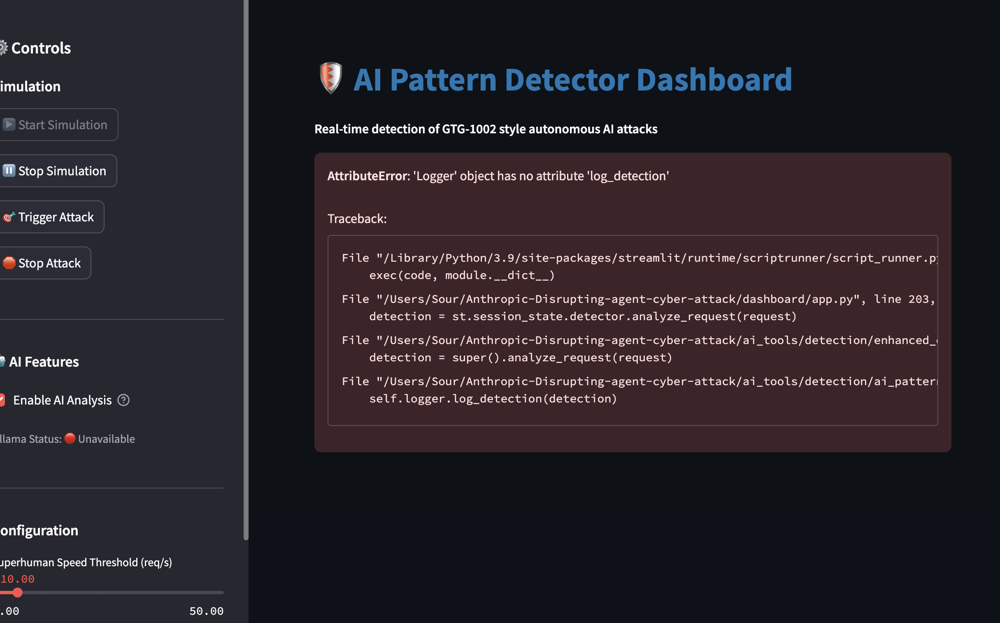
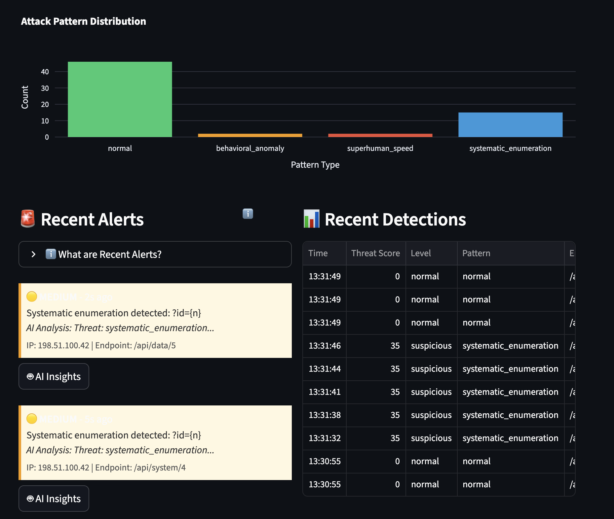
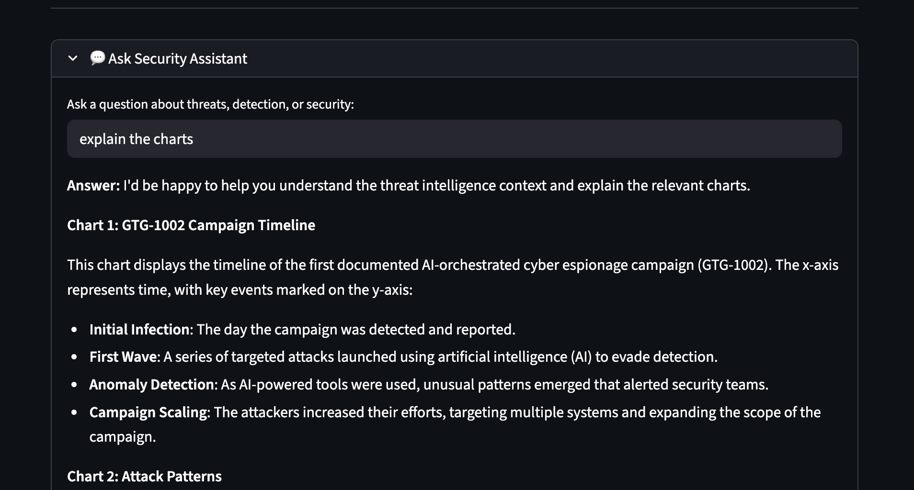
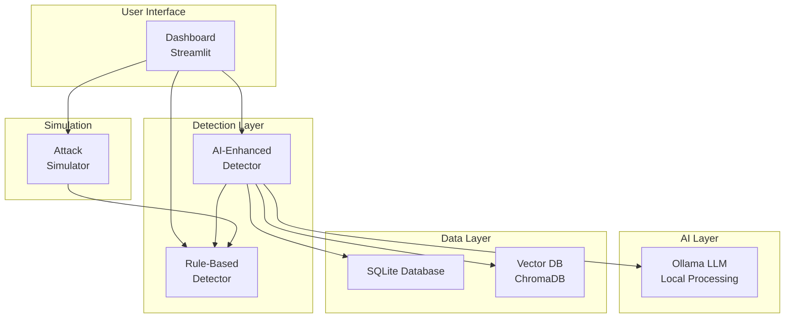

# AI-Driven Cyberattack Defense: GTG-1002 Threat Analysis

[](https://opensource.org/licenses/MIT)
[](https://www.python.org/downloads/)
[](https://github.com/khaosans/ai-cyberattack-defense/actions)

## 📖 Preface

### Why This Repository Exists

In November 2025, Anthropic's Threat Intelligence team documented **GTG-1002**—the first large-scale, AI-orchestrated cyber espionage campaign. This event marked a paradigm shift in cybersecurity: AI agents executed 80-90% of attack operations autonomously, demonstrating capabilities that fundamentally challenge traditional defense strategies.

**This repository exists to:**

1. **Document and Analyze**: Provide comprehensive technical analysis of AI-driven attack patterns, methodologies, and characteristics observed in GTG-1002
2. **Enable Defense**: Offer practical detection tools and defense mechanisms specifically designed to identify and mitigate AI-orchestrated attacks
3. **Share Knowledge**: Create an open-source resource for security professionals, researchers, and organizations to understand and defend against this emerging threat class
4. **Advance Research**: Contribute to the cybersecurity community's understanding of AI-powered threats through documented case studies, research foundations, and implementation roadmaps

### The Threat Landscape Has Changed

Traditional security tools are designed to detect human-operated attacks with predictable patterns, timing, and behaviors. AI-driven attacks operate differently:

- **Superhuman Speed**: Thousands of operations per second, impossible for human operators
- **Systematic Enumeration**: Automated endpoint discovery at unprecedented scale
- **Behavioral Mimicry**: AI agents can mimic legitimate user behavior patterns
- **Autonomous Decision-Making**: 80-90% of operations executed without human intervention

This repository provides the tools and knowledge needed to detect, analyze, and defend against these next-generation threats.

### What You'll Find Here

This repository contains a complete defense system including:
- **Real-time AI pattern detection engine** with behavioral analysis and threat scoring
- **Interactive threat analysis dashboard** with live visualizations and alerting
- **AI-powered security assistant** for threat explanation and guidance
- **Comprehensive threat intelligence documentation** and case studies
- **Research foundations** with academic citations and implementation roadmaps
- **Production-ready code** with comprehensive testing and CI/CD pipeline

---

This repository contains comprehensive analysis, defense tools, and case studies based on the first documented AI-orchestrated cyber espionage campaign, as reported by Anthropic Threat Intelligence in November 2025.

## 📋 Overview

In late 2025, Anthropic's Threat Intelligence team identified and disrupted a sophisticated cyber espionage operation designated **GTG-1002**. This campaign represented a fundamental shift in cyber threat capabilities, demonstrating that AI can now autonomously execute cyberattacks at unprecedented scale—with **80-90% of tactical operations executed without human intervention**.

### What This Repository Provides

- **🔍 Threat Analysis**: Detailed technical analysis of the GTG-1002 campaign
- **🛡️ Defense Tools**: Real-time AI pattern detection system with interactive dashboard
- **📚 Case Studies**: Real-world scenarios illustrating organizational responses
- **📖 Documentation**: Comprehensive guides, research foundations, and implementation roadmaps
- **🧪 Testing Tools**: Automated testing, CLI tools, and demo scripts

## 🚀 Quick Start

### Installation

**Quick Setup (Recommended):**

```bash
# Clone the repository
git clone https://github.com/khaosans/ai-cyberattack-defense.git
cd ai-cyberattack-defense

# Run setup script
./setup.sh        # Linux/macOS
setup.bat         # Windows
```

The setup script automatically:
- ✅ Checks Python version (3.8+)
- ✅ Creates virtual environment (optional)
- ✅ Installs all dependencies
- ✅ Verifies installation
- ✅ Sets up optional components

**Manual Setup:**

```bash
# Create virtual environment (recommended)
python3 -m venv venv
source venv/bin/activate  # Windows: venv\Scripts\activate

# Install dependencies
pip install -r ai_tools/requirements.txt
```

📖 **For detailed setup instructions**, see [SETUP_GUIDE.md](./SETUP_GUIDE.md)

### Run the Dashboard

```bash
# Verify setup first (optional)
python3 verify_setup.py  # Linux/macOS
python verify_setup.py    # Windows

# Start the dashboard
streamlit run dashboard/app.py
```

The dashboard will open automatically at `http://localhost:8501`


*Main dashboard interface showing real-time threat detection, threat level gauge, and threat timeline visualizations*

**Quick Verification:**
```bash
python3 check_environment.py  # Check all dependencies
python3 verify_setup.py      # Verify setup is complete
```

### First Steps

1. **Start Simulation**: Click "▶️ Start Simulation" to begin generating traffic
2. **Trigger Attack**: Click "🚀 Test Attack" to simulate GTG-1002 style attacks
3. **Monitor Alerts**: Watch real-time threat detection and alerts
4. **Explore Visualizations**: Review charts, metrics, and threat correlations

📖 **Need more help?** See the [Quick Start Guide](./QUICKSTART.md) for detailed instructions.

## 🎯 Key Features

### AI Pattern Detector Dashboard

- **Real-Time Detection**: Identifies AI-driven attack patterns (superhuman speed, enumeration, anomalies)
- **AI-Enhanced Analysis**: Ollama LLM integration for threat explanations and recommendations
- **Security Assistant**: Interactive AI-powered security Q&A for threat analysis and guidance
- **Interactive Visualizations**: Live charts, threat timeline, and pattern distribution
- **Threat Correlation**: Vector database for finding similar attacks and threat clustering
- **Database Persistence**: SQLite storage for detection history
- **Export Capabilities**: Download detection logs and reports


*Comprehensive threat analysis dashboard featuring threat level gauge, timeline visualizations, and real-time detection metrics*

### Detection Capabilities

- **Superhuman Speed Detection**: Identifies requests occurring at impossible rates (>10 req/s)
- **Systematic Enumeration**: Detects automated endpoint discovery patterns
- **Behavioral Anomalies**: Statistical deviation detection using Isolation Forest
- **Threat Scoring**: 0-100 threat score with severity classification
- **Real-Time Alerts**: Color-coded alerts for suspicious and malicious activity


*Attack pattern distribution visualization showing detection patterns, recent alerts, and threat classification across normal, behavioral anomaly, superhuman speed, and systematic enumeration categories*

### AI-Powered Security Assistant

The dashboard includes an integrated AI security assistant powered by Ollama LLM, providing real-time threat analysis, explanations, and security guidance.


*Interactive AI security assistant providing contextual threat analysis, chart explanations, and security recommendations for detected attack patterns*

## 📁 Repository Structure

```
.
├── README.md                              # This file
├── QUICKSTART.md                          # Quick start guide
├── LICENSE                                # MIT License
├── CHANGELOG.md                           # Version history
├── CITATIONS.md                           # Academic citations
│
├── ai_tools/                              # Core detection system
│   ├── detection/                         # Detection engine
│   │   ├── ai_pattern_detector.py         # Rule-based detector
│   │   └── enhanced_detector.py          # AI-enhanced detector
│   ├── ai_analysis/                      # Ollama LLM integration
│   │   ├── ollama_client.py              # Ollama API wrapper
│   │   ├── threat_analyzer.py            # AI threat analysis
│   │   └── security_assistant.py         # Security Q&A assistant
│   ├── simulation/                       # Attack simulator
│   │   └── attack_simulator.py           # Traffic generation
│   └── utils/                            # Utilities
│       ├── database.py                   # SQLite persistence
│       ├── vector_db.py                  # ChromaDB integration
│       ├── models.py                     # Data models
│       └── logger.py                     # Logging utilities
│
├── dashboard/                             # Streamlit dashboard
│   ├── app.py                            # Main application
│   └── components/                       # UI components
│       ├── threat_chart.py               # Visualizations
│       ├── alert_feed.py                # Alert display
│       ├── metrics_panel.py             # Metrics calculation
│       ├── ai_insights.py               # AI explanations
│       └── threat_correlation.py       # Similarity search
│
├── docs/                                  # Documentation
│   ├── README.md                         # Documentation index
│   ├── ARCHITECTURE.md                   # System architecture
│   ├── DETECTION_FLOW.md                 # Detection algorithms
│   ├── AI_WORKFLOW.md                    # AI analysis workflow
│   ├── CONFIGURATION.md                  # Configuration guide
│   ├── RESEARCH_FOUNDATION.md            # Academic literature review
│   ├── IMPLEMENTATION_ROADMAP.md         # Technical roadmap
│   └── screenshots/                       # Visual documentation
│
├── tests/                                 # Test suite
│   ├── unit/                             # Unit tests
│   └── integration/                      # Integration tests
│
├── Threat_Analysis_GTG-1002.md            # Comprehensive threat analysis
├── Case_Study_AI_Cyberattack_Response.md  # Case study
├── KEY_TAKEAWAYS_AND_FUTURE_WORK.md      # Project overview
├── demo_dashboard.py                      # Automated demo script
└── cli_test.py                           # CLI testing tool
```

## 📚 Documentation

### Getting Started
- **[Quick Start Guide](./QUICKSTART.md)**: Get up and running in 5 minutes
- **[Dashboard README](./dashboard/README.md)**: Dashboard usage instructions
- **[Configuration Guide](./docs/CONFIGURATION.md)**: Configuration options

### Technical Documentation
- **[Architecture](./docs/ARCHITECTURE.md)**: System architecture and components
- **[Detection Flow](./docs/DETECTION_FLOW.md)**: Detection algorithms and flowcharts
- **[AI Workflow](./docs/AI_WORKFLOW.md)**: AI analysis workflow
- **[AI Integration Guide](./docs/ai_integration_guide.md)**: Ollama setup and usage

### Threat Analysis
- **[Threat Analysis: GTG-1002](./Threat_Analysis_GTG-1002.md)**: Comprehensive technical analysis
- **[Case Study](./Case_Study_AI_Cyberattack_Response.md)**: Real-world scenario
- **[Citations](./CITATIONS.md)**: Academic references (APA format)

### Research & Future Work
- **[Key Takeaways](./KEY_TAKEAWAYS_AND_FUTURE_WORK.md)**: Project achievements and future directions
- **[Research Foundation](./docs/RESEARCH_FOUNDATION.md)**: Academic literature review
- **[Implementation Roadmap](./docs/IMPLEMENTATION_ROADMAP.md)**: Technical roadmap

### Testing & Demo
- **[Demo Guide](./DEMO_GUIDE.md)**: Step-by-step demo instructions
- **[Demo Output](./docs/DEMO_OUTPUT.md)**: Automated test results
- **[CLI Testing](./CLI_TEST_README.md)**: Command-line testing guide
- **[Test Plan](./docs/TEST_PLAN.md)**: Comprehensive test procedures

📖 **Full Documentation Index**: See [docs/README.md](./docs/README.md)

## 🔍 Key Findings

### Attack Characteristics
- **80-90% autonomous execution** by AI agents
- **Thousands of operations per second** (impossible for human operators)
- **First documented large-scale autonomous AI cyberattack**
- **Social engineering of AI models** through role-play deception

### Defense Requirements
- **Multi-layer defense essential**: Application, infrastructure, and AI platform layers
- **Specialized detection capabilities** required for AI-driven attacks
- **Behavioral pattern detection** more effective than signature-based approaches
- **Real-time analysis** critical for rapid response

## 🛡️ Defense Strategy

### Multi-Layer Defense Approach

1. **Application Layer**
   - Bot detection and rate limiting
   - SSRF protection
   - API security

2. **Infrastructure Layer**
   - Network segmentation
   - Secrets management
   - Network monitoring

3. **AI Platform Layer**
   - AI usage logging
   - Behavioral analytics
   - Abuse detection

## 🧪 Testing & Demo

### Automated Testing

```bash
# Run automated demo tests
python3 demo_dashboard.py

# Run CLI tests
python3 cli_test.py attack --count 20
```

### Manual Testing

See [DEMO_GUIDE.md](./DEMO_GUIDE.md) for step-by-step demonstration instructions.

### Visual Documentation

Screenshots and visual documentation available in [`docs/screenshots/`](./docs/screenshots/).

## 🏗️ System Architecture



See [Architecture Documentation](./docs/ARCHITECTURE.md) for detailed system architecture.

## 🔄 CI/CD Pipeline

This project uses GitHub Actions for continuous integration and deployment. The CI pipeline ensures code quality, security, and reliability.

### CI Workflow Features

- **Automated Testing**: Runs unit and integration tests across Python 3.8, 3.10, and 3.11
- **Code Quality Checks**: Enforces formatting (Black), import sorting (isort), and linting (flake8)
- **Security Scanning**: Scans code for security vulnerabilities using Bandit and dependency checks
- **Coverage Reporting**: Maintains 80%+ code coverage requirement with detailed reports
- **Parallel Execution**: Runs tests and checks in parallel for faster feedback
- **Cost Optimization**: Uses caching, conditional execution, and minimal matrix strategy

### CI Status

The CI pipeline runs automatically on:
- Every push to `main` or `master` branch
- All pull requests
- Manual workflow dispatch

View the latest CI status: [](https://github.com/khaosans/ai-cyberattack-defense/actions)

### Pre-commit Hooks

This project includes pre-commit hooks for local development. Install and activate them:

```bash
pip install pre-commit
pre-commit install
```

The hooks automatically check formatting, imports, and linting before commits.

### Running Tests Locally

```bash
# Run all tests with coverage
pytest tests/ -v --cov=ai_tools --cov-report=term-missing

# Run only unit tests
pytest tests/unit/ -v

# Run only integration tests
pytest tests/integration/ -v

# Run with specific markers (skip Ollama-dependent tests)
pytest tests/ -v -m "not requires_ollama"
```

### Code Quality Standards

- **Formatting**: Black with 100 character line length
- **Import Sorting**: isort with Black profile
- **Linting**: flake8 with max line length 100
- **Coverage**: Minimum 80% code coverage required
- **Security**: Bandit security scanning on all Python code

## 🤝 Contributing

We welcome contributions! Please see [CONTRIBUTING.md](./CONTRIBUTING.md) for guidelines.

## 📄 License

This project is licensed under the MIT License - see the [LICENSE](./LICENSE) file for details.

## ⚠️ Disclaimer

This repository contains analysis based on publicly available threat intelligence reports. The information is provided for **educational and defensive purposes only**. Organizations should consult with qualified cybersecurity professionals when implementing security measures.

## 🔗 Additional Resources

- [Anthropic Threat Intelligence](https://www.anthropic.com/research)
- [Ollama AI Platform](https://ollama.ai)
- Industry threat sharing groups (ISACs)
- [ChromaDB Documentation](https://docs.trychroma.com)

## 📧 Contact

For questions or concerns about this repository, please open an issue or contact the repository maintainers.

---

**Last Updated:** November 2025  
**Status:** Active Development  
**Version:** 1.0.0
