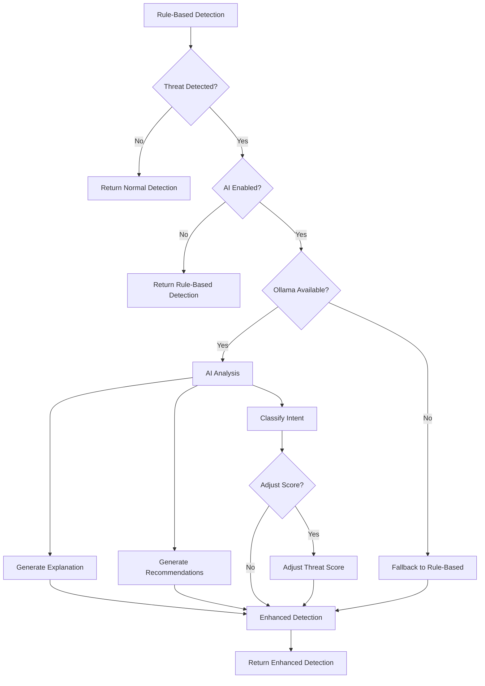
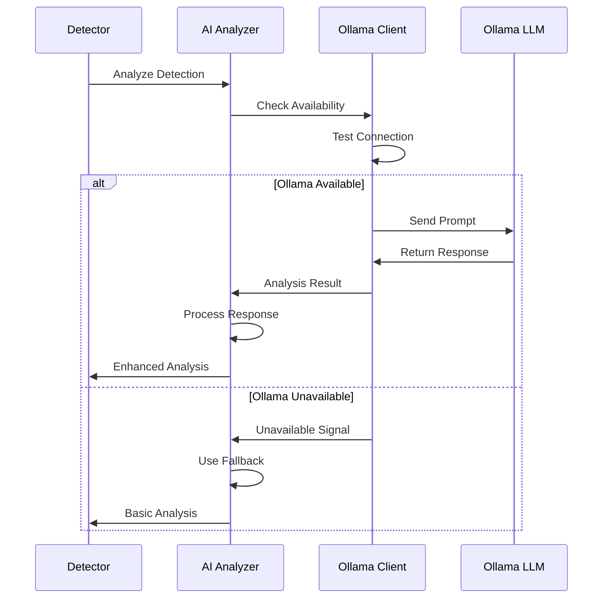
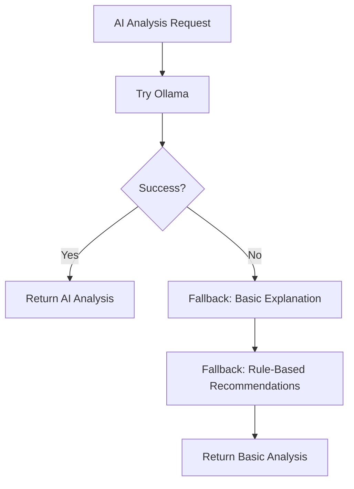

# AI Analysis Workflow

## Overview

This document describes the AI analysis workflow, Ollama integration flow, and fallback mechanisms.

## AI Enhancement Flow

## Ollama Integration Flow

## AI Analysis Components

### 1. Request Pattern Analysis

**Purpose**: Analyze request patterns for threat indicators

**Flow**:
1. Build context-aware prompt
2. Send to Ollama LLM
3. Parse response
4. Extract threat indicators

### 2. Intent Classification

**Purpose**: Classify request intent (reconnaissance, enumeration, exploitation, etc.)

**Flow**:
1. Prepare request data
2. Generate classification prompt
3. Get LLM response
4. Parse JSON classification
5. Return intent + confidence

### 3. Threat Explanation

**Purpose**: Generate natural language threat explanation

**Flow**:
1. Prepare detection data
2. Generate explanation prompt
3. Get LLM response
4. Format explanation
5. Return to user

### 4. Response Recommendations

**Purpose**: Generate security recommendations

**Flow**:
1. Analyze detection context
2. Generate recommendation prompt
3. Get LLM response
4. Parse recommendations
5. Prioritize actions

## Fallback Mechanisms

## Error Handling

1. **Connection Errors**: Gracefully degrade to rule-based
2. **Timeout Errors**: Return cached or basic response
3. **Invalid Responses**: Parse best effort or use fallback
4. **Model Errors**: Log and continue without AI

## Performance Considerations

- **Caching**: Cache common analyses
- **Async Processing**: Non-blocking AI calls
- **Timeout**: 5-second timeout for LLM calls
- **Retry**: Single retry on failure

## References

- Ollama. (2025). *Ollama: Get up and running with large language models* [Software Documentation]. Ollama. https://ollama.ai
- Anthropic. (2025, November 17). *Disrupting the first reported AI-orchestrated cyber espionage campaign* [Threat Intelligence Report]. Anthropic. https://www.anthropic.com/research/disrupting-ai-cyber-espionage

---

**Last Updated**: 2025-01-XX
**Version**: 1.0

