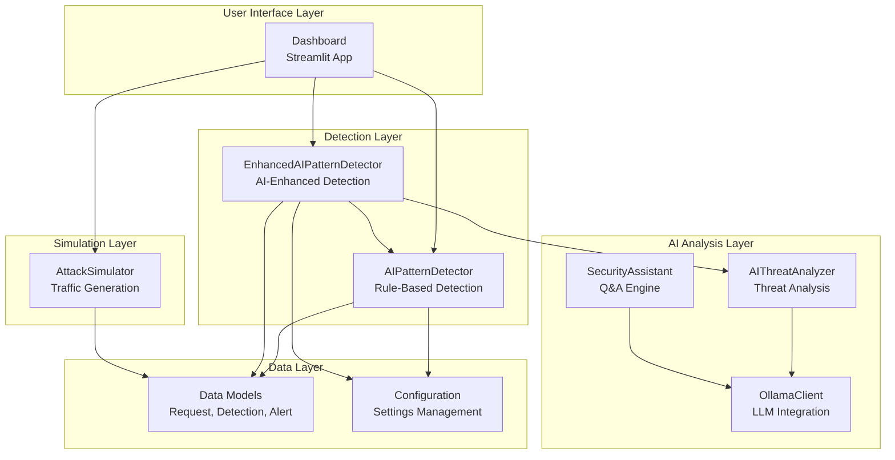
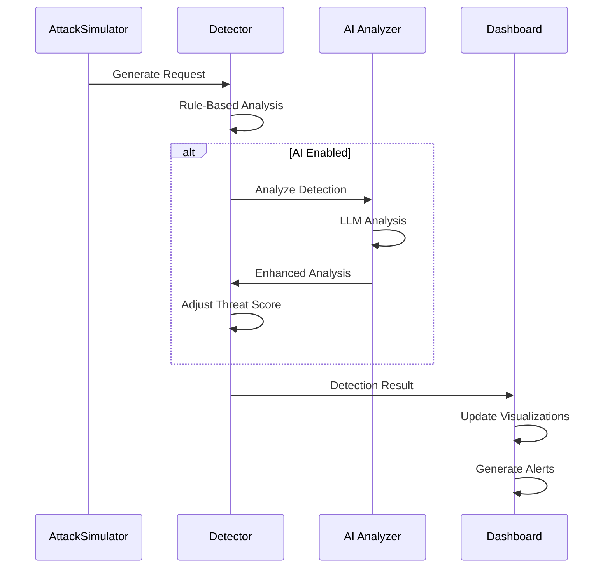
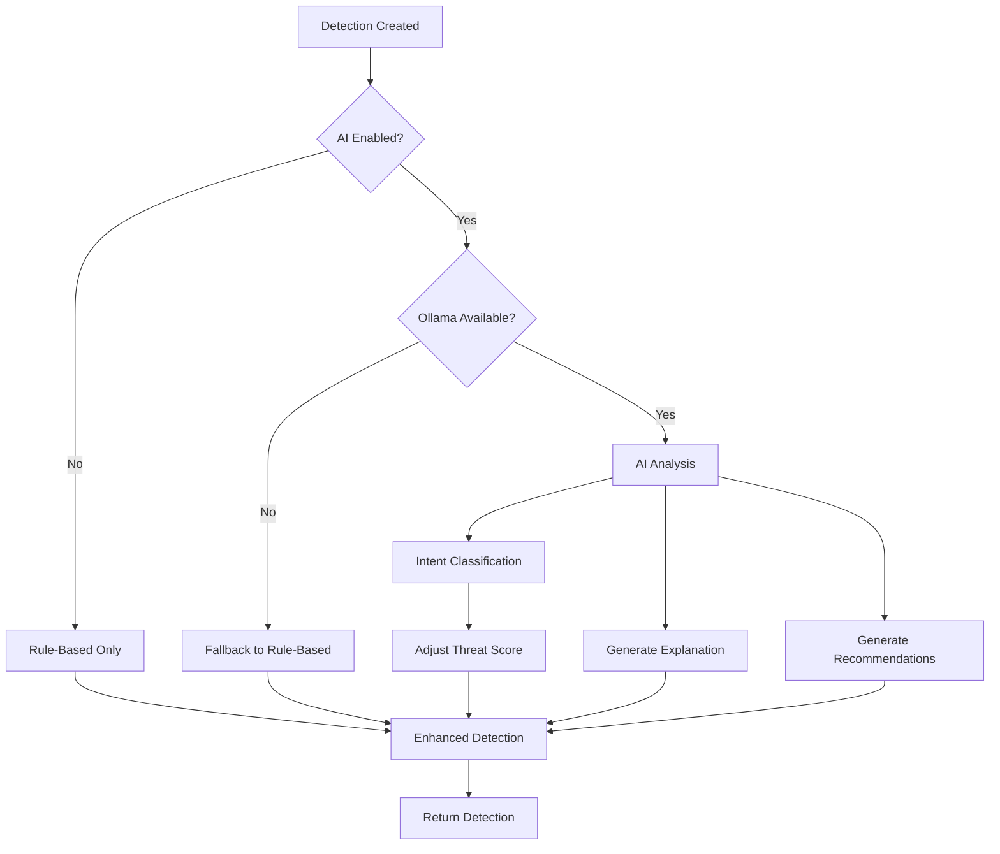
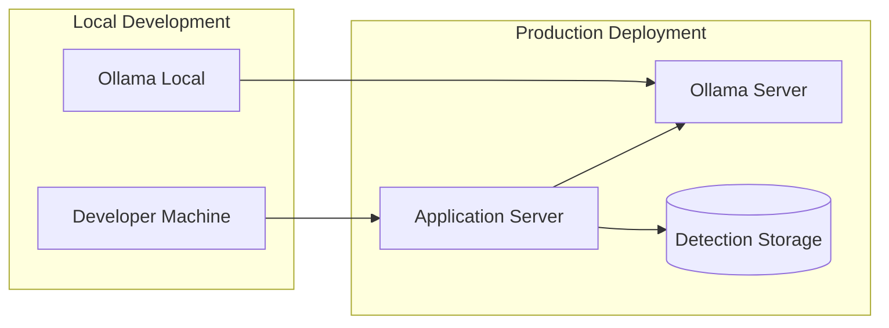

# System Architecture

## Overview

The AI Pattern Detector is a multi-component system designed to detect GTG-1002 style autonomous AI-driven cyberattacks. This document describes the system architecture, component relationships, and data flow.

## High-Level Architecture

## Component Details

### 1. User Interface Layer

**Dashboard (Streamlit App)**
- **Location**: `dashboard/app.py`
- **Purpose**: Interactive web interface for real-time threat visualization
- **Components**:
  - Metrics panel
  - Threat visualizations (timeline, gauge, distribution)
  - Alert feed
  - Configuration controls
  - AI insights panel

### 2. Detection Layer

**AIPatternDetector**
- **Location**: `ai_tools/detection/ai_pattern_detector.py`
- **Purpose**: Core rule-based detection engine
- **Capabilities**:
  - Superhuman speed detection
  - Systematic enumeration detection
  - Behavioral anomaly detection
  - Threat scoring (0-100)

**EnhancedAIPatternDetector**
- **Location**: `ai_tools/detection/enhanced_detector.py`
- **Purpose**: AI-enhanced detection combining rule-based and AI analysis
- **Capabilities**:
  - Inherits all AIPatternDetector capabilities
  - AI-powered threat analysis
  - Natural language explanations
  - False positive reduction
  - Dynamic threat scoring

### 3. AI Analysis Layer

**OllamaClient**
- **Location**: `ai_tools/ai_analysis/ollama_client.py`
- **Purpose**: Wrapper for local Ollama LLM integration
- **Capabilities**:
  - Connection management
  - Request pattern analysis
  - Intent classification
  - Threat explanation generation
  - Response recommendation

**AIThreatAnalyzer**
- **Location**: `ai_tools/ai_analysis/threat_analyzer.py`
- **Purpose**: Enhanced threat analysis using Ollama
- **Capabilities**:
  - Context-aware pattern recognition
  - Attack scenario generation
  - Incident report generation
  - Threat explanation

**SecurityAssistant**
- **Location**: `ai_tools/ai_analysis/security_assistant.py`
- **Purpose**: AI-powered security advisor
- **Capabilities**:
  - Q&A interface
  - Security recommendations
  - Detection logic explanation
  - Incident summary generation

### 4. Simulation Layer

**AttackSimulator**
- **Location**: `ai_tools/simulation/attack_simulator.py`
- **Purpose**: Generate realistic network traffic for testing
- **Capabilities**:
  - Normal traffic generation
  - Attack traffic generation
  - Configurable attack intensity
  - Realistic request patterns

### 5. Data Layer

**Data Models**
- **Location**: `ai_tools/utils/models.py`
- **Types**:
  - `Request`: HTTP request representation
  - `Detection`: Threat detection result
  - `Alert`: Security alert
  - `ThreatLevel`: Enum (normal, suspicious, malicious)
  - `PatternType`: Enum (normal, superhuman_speed, systematic_enumeration, behavioral_anomaly)

**Configuration**
- **Location**: `ai_tools/config.py`
- **Purpose**: Centralized configuration management
- **Settings**:
  - Detection thresholds
  - Request history limits
  - Dashboard refresh rates
  - Ollama configuration
  - AI feature flags

## Data Flow

### Request Analysis Flow

### AI Enhancement Flow

## Integration Points

### 1. Dashboard ↔ Detector

- **Interface**: Direct Python imports
- **Data**: `Detection` objects
- **Frequency**: Real-time (every 2 seconds)

### 2. Detector ↔ AI Analyzer

- **Interface**: Method calls (`analyze_detection()`)
- **Data**: `Detection` objects → AI analysis dictionaries
- **Frequency**: On-demand (when threat detected)

### 3. AI Analyzer ↔ Ollama

- **Interface**: HTTP API calls
- **Data**: Prompts → LLM responses
- **Frequency**: On-demand (when AI analysis requested)

### 4. Simulator → Detector

- **Interface**: Generator pattern (`generate_requests()`)
- **Data**: `Request` objects
- **Frequency**: Continuous (configurable rate)

## Deployment Architecture

## Security Considerations

1. **Local Processing**: All AI analysis happens locally (no data leaves environment)
2. **Graceful Degradation**: System works without Ollama
3. **Error Handling**: Comprehensive error handling prevents crashes
4. **Input Validation**: All inputs validated before processing
5. **No Sensitive Data**: No sensitive data sent to LLM

## Performance Characteristics

- **Request Processing**: < 100ms per request
- **AI Analysis**: < 2 seconds per detection (when enabled)
- **Dashboard Refresh**: 2 seconds (configurable)
- **Memory Usage**: Scales with detection history (max 1000 detections)

## Scalability

- **Horizontal Scaling**: Multiple detector instances possible
- **Vertical Scaling**: Limited by single-threaded Python
- **AI Bottleneck**: Ollama inference time
- **Storage**: In-memory (can be extended to persistent storage)

## Future Enhancements

1. **Persistent Storage**: Database integration for detection history
2. **Distributed Processing**: Multi-instance deployment
3. **Advanced Caching**: LLM response caching
4. **Real-time Streaming**: WebSocket support for live updates
5. **Multi-model Support**: Support for multiple LLM providers

## References

- Anthropic. (2025, November 17). *Disrupting the first reported AI-orchestrated cyber espionage campaign* [Threat Intelligence Report]. Anthropic. https://www.anthropic.com/research/disrupting-ai-cyber-espionage

---

**Last Updated**: 2025-01-XX
**Version**: 1.0

