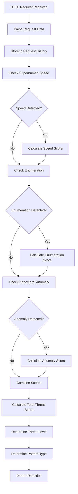
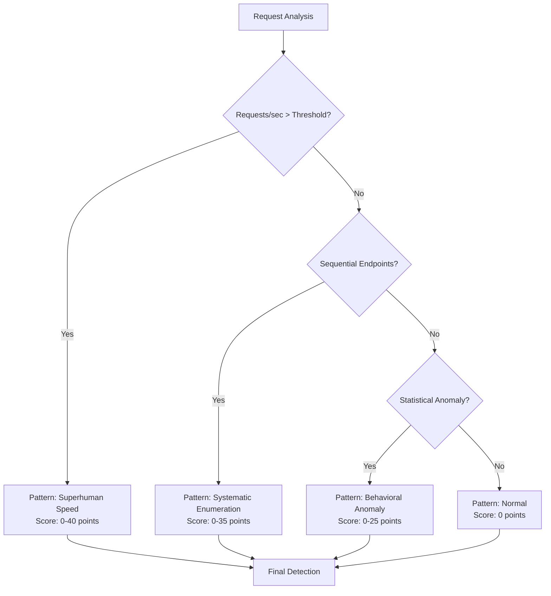
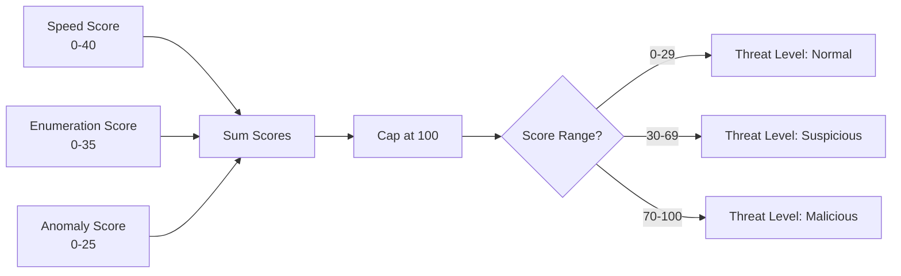

# Detection Algorithm Flow

## Overview

This document describes the detection algorithm flow, decision trees, and threat scoring process for the AI Pattern Detector.

## Request Analysis Flow



## Pattern Detection Decision Tree



## Threat Scoring Process



## Superhuman Speed Detection

**Algorithm**:
1. Track requests per second over 10-second window
2. Calculate average rate
3. Compare to threshold (default: 10 req/s)
4. If exceeded, calculate score based on excess

**Scoring Formula**:
```
speed_score = min(40, (rps / threshold) * 30)
```

## Systematic Enumeration Detection

**Algorithm**:
1. Track endpoint access patterns
2. Identify sequential numeric patterns (e.g., /api/users/1, /api/users/2)
3. Count sequence length
4. If length >= threshold (default: 5), flag as enumeration

**Scoring Formula**:
```
enum_score = min(35, sequence_length * 5)
```

## Behavioral Anomaly Detection

**Algorithm**:
1. Track statistical features:
   - Endpoint depth
   - Parameter count
   - Request intervals
2. Use Isolation Forest for anomaly detection
3. Calculate z-score for anomalies
4. Flag if z-score > threshold (default: 2.0)

**Scoring Formula**:
```
anomaly_score = min(25, (z_score / threshold) * 20)
```

## Threat Level Determination

- **Normal**: Score 0-29
- **Suspicious**: Score 30-69
- **Malicious**: Score 70-100

## Pattern Type Priority

1. Superhuman Speed (highest priority)
2. Systematic Enumeration
3. Behavioral Anomaly
4. Normal (default)

---

**Last Updated**: 2025-01-XX
**Version**: 1.0

