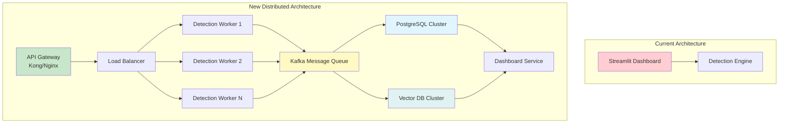

# Implementation Roadmap: Technical Enhancements and Code Changes

## Overview

This document provides a detailed technical roadmap for implementing the future work outlined in [KEY_TAKEAWAYS_AND_FUTURE_WORK.md](../KEY_TAKEAWAYS_AND_FUTURE_WORK.md). Each enhancement includes specific code changes, architecture modifications, dependencies, and testing requirements.

## Roadmap Structure

The roadmap is organized by priority and implementation complexity:
- **Quick Wins**: Low-effort, high-impact improvements (1-3 months)
- **Medium-Term**: Moderate complexity enhancements (3-6 months)
- **Long-Term**: Complex architectural changes (6-12 months)

---

## Quick Wins (1-3 Months)

### 1. Enhanced Visualizations

**Objective:** Improve dashboard charts and user interface

**Current State:**
- Basic Plotly charts (timeline, gauge, distribution)
- Simple status indicators
- Limited interactivity

**Proposed Changes:**

#### 1.1 3D Threat Landscape Visualization

**Files to Create:**
- `dashboard/components/threat_landscape.py`

**Code Changes:**

```python
# dashboard/components/threat_landscape.py
import plotly.graph_objects as go
from plotly.subplots import make_subplots

def create_3d_threat_landscape(detections: List[Detection]) -> go.Figure:
    """
    Create 3D visualization of threat space
    Dimensions: Threat Score (X), Pattern Type (Y), Time (Z)
    """
    fig = go.Figure(data=[go.Scatter3d(
        x=[d.threat_score for d in detections],
        y=[pattern_to_numeric(d.pattern_type) for d in detections],
        z=[(d.timestamp - min_time).total_seconds() for d in detections],
        mode='markers',
        marker=dict(
            size=5,
            color=[d.threat_score for d in detections],
            colorscale='RdYlGn',
            showscale=True
        )
    )])
    
    fig.update_layout(
        title="3D Threat Landscape",
        scene=dict(
            xaxis_title="Threat Score",
            yaxis_title="Pattern Type",
            zaxis_title="Time"
        )
    )
    
    return fig
```

**Integration:**
- Add to `dashboard/app.py` in charts section
- Add toggle for 2D/3D view

**Dependencies:**
- Plotly (already included)
- No new dependencies

**Testing:**
- Unit tests for 3D chart generation
- Visual regression tests
- Performance testing with large datasets

---

#### 1.2 Network Topology Visualization

**Files to Create:**
- `dashboard/components/network_topology.py`

**Code Changes:**

```python
# dashboard/components/network_topology.py
import networkx as nx
import plotly.graph_objects as go

def create_attack_topology(detections: List[Detection]) -> go.Figure:
    """
    Create network graph showing attack paths
    Nodes: IPs, Endpoints
    Edges: Attack relationships
    """
    G = nx.Graph()
    
    # Add nodes and edges from detections
    for det in detections:
        ip = det.request.ip_address
        endpoint = det.request.endpoint.split('?')[0]
        
        G.add_node(ip, node_type='ip')
        G.add_node(endpoint, node_type='endpoint')
        G.add_edge(ip, endpoint, weight=det.threat_score)
    
    # Use networkx layout
    pos = nx.spring_layout(G)
    
    # Create Plotly visualization
    edge_x = []
    edge_y = []
    for edge in G.edges():
        x0, y0 = pos[edge[0]]
        x1, y1 = pos[edge[1]]
        edge_x.extend([x0, x1, None])
        edge_y.extend([y0, y1, None])
    
    edge_trace = go.Scatter(
        x=edge_x, y=edge_y,
        line=dict(width=0.5, color='#888'),
        hoverinfo='none',
        mode='lines'
    )
    
    # Node traces
    node_traces = []
    for node_type in ['ip', 'endpoint']:
        nodes = [n for n in G.nodes() if G.nodes[n]['node_type'] == node_type]
        node_x = [pos[n][0] for n in nodes]
        node_y = [pos[n][1] for n in nodes]
        
        node_trace = go.Scatter(
            x=node_x, y=node_y,
            mode='markers',
            name=node_type,
            marker=dict(size=10)
        )
        node_traces.append(node_trace)
    
    fig = go.Figure(data=[edge_trace] + node_traces)
    return fig
```

**Dependencies:**
- `networkx>=3.0` (add to requirements.txt)

**Testing:**
- Test with various network sizes
- Performance testing
- Visual validation

---

### 2. REST API Development

**Objective:** Create REST API for external system integration

**Files to Create:**
- `api/__init__.py`
- `api/main.py`
- `api/routes/detections.py`
- `api/routes/threats.py`
- `api/routes/health.py`
- `api/models/schemas.py`

**Code Structure:**

```python
# api/main.py
from fastapi import FastAPI
from api.routes import detections, threats, health

app = FastAPI(
    title="AI Pattern Detector API",
    description="REST API for threat detection system",
    version="1.0.0"
)

app.include_router(health.router, prefix="/health", tags=["health"])
app.include_router(detections.router, prefix="/api/v1/detections", tags=["detections"])
app.include_router(threats.router, prefix="/api/v1/threats", tags=["threats"])

# api/routes/detections.py
from fastapi import APIRouter, HTTPException
from api.models.schemas import DetectionResponse, DetectionList

router = APIRouter()

@router.get("/", response_model=DetectionList)
async def get_detections(
    limit: int = 100,
    threat_level: Optional[str] = None,
    start_time: Optional[datetime] = None
):
    """Get recent detections"""
    # Implementation
    pass

@router.get("/{detection_id}", response_model=DetectionResponse)
async def get_detection(detection_id: int):
    """Get specific detection"""
    # Implementation
    pass

@router.post("/analyze", response_model=DetectionResponse)
async def analyze_request(request: RequestInput):
    """Analyze a request for threats"""
    # Implementation
    pass
```

**Dependencies:**
- `fastapi>=0.104.0`
- `uvicorn>=0.24.0`
- `pydantic>=2.0.0` (already included)

**Testing:**
- API endpoint tests
- Integration tests
- Performance testing
- OpenAPI documentation validation

**Integration:**
- Add API server option to dashboard
- Separate API deployment option
- API authentication (JWT tokens)

---

### 3. Performance Optimization

**Objective:** Improve current system performance

**Code Changes:**

#### 3.1 Caching for Chart Generation

**Files to Modify:**
- `dashboard/components/threat_chart.py`

**Changes:**

```python
from functools import lru_cache
from datetime import datetime, timedelta

@lru_cache(maxsize=100)
def create_threat_timeline_cached(
    detection_hash: str,
    window_minutes: int = 10
) -> str:
    """
    Cached version of timeline creation
    Uses hash of detection data for cache key
    """
    # Implementation with caching
    pass
```

#### 3.2 Database Query Optimization

**Files to Modify:**
- `ai_tools/utils/database.py`

**Changes:**

```python
# Add indexes to database
def _create_tables(self):
    cursor = self.conn.cursor()
    
    # Existing table creation...
    
    # Add indexes for performance
    cursor.execute("""
        CREATE INDEX IF NOT EXISTS idx_timestamp 
        ON detections(timestamp DESC)
    """)
    
    cursor.execute("""
        CREATE INDEX IF NOT EXISTS idx_threat_level 
        ON detections(threat_level)
    """)
    
    cursor.execute("""
        CREATE INDEX IF NOT EXISTS idx_ip_endpoint 
        ON detections(ip_address, endpoint)
    """)
```

**Testing:**
- Performance benchmarks
- Query time measurements
- Load testing

---

## Medium-Term Enhancements (3-6 Months)

### 1. Machine Learning-Based Detection

**Objective:** Add ML models for improved detection accuracy

**Files to Create:**
- `ai_tools/detection/ml_detector.py`
- `ai_tools/utils/feature_extractor.py`
- `scripts/train_models.py`
- `models/` directory for trained models
- `data/` directory for training data

**Code Structure:**

```python
# ai_tools/utils/feature_extractor.py
import numpy as np
from typing import List
from ai_tools.utils.models import Request, Detection

class FeatureExtractor:
    """Extract features from requests for ML models"""
    
    def extract(self, request: Request, history: List[Request]) -> np.ndarray:
        """
        Extract feature vector from request and history
        
        Features:
        - Request rate (last N requests)
        - Endpoint pattern features
        - Temporal features
        - Behavioral features
        """
        features = []
        
        # Request rate features
        if len(history) > 0:
            recent = history[-10:]  # Last 10 requests
            time_span = (request.timestamp - recent[0].timestamp).total_seconds()
            if time_span > 0:
                rate = len(recent) / time_span
                features.append(rate)
            else:
                features.append(0.0)
        else:
            features.append(0.0)
        
        # Endpoint pattern features
        endpoint_features = self._extract_endpoint_features(request.endpoint)
        features.extend(endpoint_features)
        
        # Temporal features
        temporal_features = self._extract_temporal_features(request, history)
        features.extend(temporal_features)
        
        # Behavioral features
        behavioral_features = self._extract_behavioral_features(request, history)
        features.extend(behavioral_features)
        
        return np.array(features)
    
    def _extract_endpoint_features(self, endpoint: str) -> List[float]:
        """Extract features from endpoint path"""
        # Normalize endpoint
        path = endpoint.split('?')[0]
        parts = path.split('/')
        
        features = [
            len(parts),  # Path depth
            len(endpoint),  # Total length
            endpoint.count('/'),  # Number of slashes
            int(any(part.isdigit() for part in parts)),  # Has numeric IDs
        ]
        
        return features
    
    def _extract_temporal_features(
        self, 
        request: Request, 
        history: List[Request]
    ) -> List[float]:
        """Extract temporal pattern features"""
        if len(history) < 2:
            return [0.0, 0.0, 0.0]
        
        # Time between requests
        intervals = []
        for i in range(1, len(history)):
            interval = (history[i].timestamp - history[i-1].timestamp).total_seconds()
            intervals.append(interval)
        
        if intervals:
            return [
                np.mean(intervals),  # Average interval
                np.std(intervals) if len(intervals) > 1 else 0.0,  # Std deviation
                min(intervals),  # Minimum interval
            ]
        
        return [0.0, 0.0, 0.0]
    
    def _extract_behavioral_features(
        self,
        request: Request,
        history: List[Request]
    ) -> List[float]:
        """Extract behavioral pattern features"""
        # Enumeration pattern detection
        if len(history) >= 3:
            endpoints = [r.endpoint for r in history[-3:]] + [request.endpoint]
            enum_score = self._detect_enumeration_pattern(endpoints)
        else:
            enum_score = 0.0
        
        # Diversity features
        unique_endpoints = len(set(r.endpoint for r in history + [request]))
        total_requests = len(history) + 1
        diversity = unique_endpoints / total_requests if total_requests > 0 else 0.0
        
        return [enum_score, diversity]
    
    def _detect_enumeration_pattern(self, endpoints: List[str]) -> float:
        """Detect sequential enumeration pattern"""
        # Extract numeric IDs
        ids = []
        for endpoint in endpoints:
            parts = endpoint.split('/')
            for part in parts:
                if part.isdigit():
                    ids.append(int(part))
        
        if len(ids) >= 3:
            # Check if sequential
            diffs = [ids[i+1] - ids[i] for i in range(len(ids)-1)]
            if all(d == diffs[0] for d in diffs) and diffs[0] > 0:
                return 1.0  # Perfect enumeration
        
        return 0.0
```

```python
# ai_tools/detection/ml_detector.py
import pickle
import numpy as np
from pathlib import Path
from typing import Optional
from ai_tools.utils.models import Request, Detection
from ai_tools.utils.feature_extractor import FeatureExtractor

class MLDetector:
    """Machine learning-based threat detector"""
    
    def __init__(self, model_path: Optional[str] = None):
        self.feature_extractor = FeatureExtractor()
        self.model = None
        
        if model_path and Path(model_path).exists():
            self.load_model(model_path)
    
    def load_model(self, model_path: str):
        """Load trained ML model"""
        with open(model_path, 'rb') as f:
            self.model = pickle.load(f)
    
    def detect(
        self, 
        request: Request, 
        history: List[Request]
    ) -> Detection:
        """Detect threats using ML model"""
        if self.model is None:
            raise ValueError("Model not loaded. Train or load a model first.")
        
        # Extract features
        features = self.feature_extractor.extract(request, history)
        features = features.reshape(1, -1)  # Reshape for model
        
        # Predict threat score
        threat_score = self.model.predict(features)[0]
        threat_score = int(np.clip(threat_score, 0, 100))  # Clamp to 0-100
        
        # Classify threat level
        if threat_score >= 70:
            threat_level = ThreatLevel.MALICIOUS
        elif threat_score >= 30:
            threat_level = ThreatLevel.SUSPICIOUS
        else:
            threat_level = ThreatLevel.NORMAL
        
        # Identify pattern (simplified - could use separate classifier)
        pattern_type = self._identify_pattern(features[0])
        
        return Detection(
            timestamp=request.timestamp,
            request=request,
            threat_score=threat_score,
            threat_level=threat_level,
            pattern_type=pattern_type,
            details={'ml_model': 'enabled', 'features': features.tolist()}
        )
    
    def _identify_pattern(self, features: np.ndarray) -> PatternType:
        """Identify attack pattern from features"""
        # Simplified pattern identification
        # In production, use separate classifier or rule-based logic
        enum_score = features[-2] if len(features) > 2 else 0
        rate = features[0] if len(features) > 0 else 0
        
        if rate > 10:
            return PatternType.SUPERHUMAN_SPEED
        elif enum_score > 0.5:
            return PatternType.SYSTEMATIC_ENUMERATION
        elif np.std(features) > np.mean(features) * 0.5:
            return PatternType.BEHAVIORAL_ANOMALY
        else:
            return PatternType.NORMAL
```

```python
# scripts/train_models.py
import pandas as pd
import numpy as np
from sklearn.ensemble import RandomForestRegressor
from sklearn.model_selection import train_test_split
from sklearn.metrics import mean_squared_error, r2_score
import pickle
from pathlib import Path

from ai_tools.utils.database import DetectionDB
from ai_tools.utils.feature_extractor import FeatureExtractor

def prepare_training_data(db: DetectionDB, limit: int = 10000):
    """Prepare training data from database"""
    detections = db.get_recent_detections(limit=limit)
    
    feature_extractor = FeatureExtractor()
    X = []
    y = []
    
    # Group detections by IP to create history
    ip_detections = {}
    for det in detections:
        ip = det.request.ip_address
        if ip not in ip_detections:
            ip_detections[ip] = []
        ip_detections[ip].append(det)
    
    # Extract features for each detection
    for ip, dets in ip_detections.items():
        for i, det in enumerate(dets):
            history = [d.request for d in dets[:i]]
            features = feature_extractor.extract(det.request, history)
            X.append(features)
            y.append(det.threat_score)
    
    return np.array(X), np.array(y)

def train_model():
    """Train ML model on detection data"""
    db = DetectionDB("detections.db")
    X, y = prepare_training_data(db)
    
    # Split data
    X_train, X_test, y_train, y_test = train_test_split(
        X, y, test_size=0.2, random_state=42
    )
    
    # Train model
    model = RandomForestRegressor(
        n_estimators=100,
        max_depth=10,
        random_state=42
    )
    model.fit(X_train, y_train)
    
    # Evaluate
    y_pred = model.predict(X_test)
    mse = mean_squared_error(y_test, y_pred)
    r2 = r2_score(y_test, y_pred)
    
    print(f"Model Performance:")
    print(f"  MSE: {mse:.2f}")
    print(f"  R²: {r2:.2f}")
    
    # Save model
    model_path = Path("models/threat_detector.pkl")
    model_path.parent.mkdir(exist_ok=True)
    with open(model_path, 'wb') as f:
        pickle.dump(model, f)
    
    print(f"Model saved to {model_path}")
    
    return model

if __name__ == "__main__":
    train_model()
```

**Integration:**

```python
# ai_tools/detection/enhanced_detector.py
# Add ML detector option

class EnhancedAIPatternDetector(AIPatternDetector):
    def __init__(
        self, 
        config: Optional[Config] = None, 
        enable_ai: bool = True,
        enable_ml: bool = False,
        ml_model_path: Optional[str] = None
    ):
        super().__init__(config)
        self.enable_ml = enable_ml
        
        if enable_ml:
            from ai_tools.detection.ml_detector import MLDetector
            self.ml_detector = MLDetector(ml_model_path)
        else:
            self.ml_detector = None
    
    def analyze_request(self, request: Request) -> Detection:
        """Analyze request with ML if enabled"""
        if self.enable_ml and self.ml_detector:
            # Use ML detector
            history = [d.request for d in self.detections[-100:]]  # Last 100
            detection = self.ml_detector.detect(request, history)
        else:
            # Use rule-based detection
            detection = super().analyze_request(request)
        
        # Continue with AI analysis if enabled
        # ... existing code ...
        
        return detection
```

**Dependencies:**
- `scikit-learn>=1.3.0` (already included)
- `numpy>=1.24.0` (already included)

**Testing:**
- Model training tests
- Feature extraction tests
- Detection accuracy tests
- Performance benchmarks

---

### 2. SIEM Integration

**Objective:** Integrate with Security Information and Event Management systems

**Files to Create:**
- `integrations/siem/__init__.py`
- `integrations/siem/base.py`
- `integrations/siem/splunk.py`
- `integrations/siem/elastic.py`
- `integrations/siem/qradar.py`
- `integrations/siem/cef_formatter.py`

**Code Structure:**

```python
# integrations/siem/base.py
from abc import ABC, abstractmethod
from ai_tools.utils.models import Detection

class SIEMConnector(ABC):
    """Base class for SIEM connectors"""
    
    @abstractmethod
    def send_detection(self, detection: Detection) -> bool:
        """Send detection to SIEM"""
        pass
    
    @abstractmethod
    def test_connection(self) -> bool:
        """Test connection to SIEM"""
        pass

# integrations/siem/cef_formatter.py
from ai_tools.utils.models import Detection
from datetime import datetime

def format_cef(detection: Detection) -> str:
    """
    Format detection as CEF (Common Event Format)
    CEF:Version|Device Vendor|Device Product|Device Version|Signature ID|Name|Severity|Extension
    """
    version = "0"
    vendor = "AI Pattern Detector"
    product = "Threat Detection"
    device_version = "1.0"
    signature_id = detection.pattern_type.value
    name = f"{detection.pattern_type.value} attack detected"
    severity = self._map_severity(detection.threat_level.value)
    
    # Extension fields
    extensions = {
        "src": detection.request.ip_address,
        "dst": detection.request.endpoint,
        "cs1": detection.threat_score,
        "cs1Label": "Threat Score",
        "cs2": detection.request.method,
        "cs2Label": "HTTP Method",
        "rt": detection.timestamp.isoformat(),
    }
    
    ext_str = " ".join(f"{k}={v}" for k, v in extensions.items())
    
    cef = f"CEF:{version}|{vendor}|{product}|{device_version}|{signature_id}|{name}|{severity}|{ext_str}"
    
    return cef

def _map_severity(threat_level: str) -> str:
    """Map threat level to CEF severity (0-10)"""
    mapping = {
        "malicious": "9",
        "suspicious": "6",
        "normal": "3"
    }
    return mapping.get(threat_level, "3")

# integrations/siem/splunk.py
import requests
from integrations.siem.base import SIEMConnector
from integrations.siem.cef_formatter import format_cef

class SplunkConnector(SIEMConnector):
    """Splunk SIEM connector"""
    
    def __init__(self, host: str, port: int = 8088, token: str = None):
        self.host = host
        self.port = port
        self.token = token
        self.url = f"http://{host}:{port}/services/collector/event"
    
    def send_detection(self, detection: Detection) -> bool:
        """Send detection to Splunk via HTTP Event Collector"""
        cef = format_cef(detection)
        
        payload = {
            "event": cef,
            "sourcetype": "ai_pattern_detector",
            "source": "threat_detection"
        }
        
        headers = {
            "Authorization": f"Splunk {self.token}",
            "Content-Type": "application/json"
        }
        
        try:
            response = requests.post(
                self.url,
                json=payload,
                headers=headers,
                timeout=5
            )
            return response.status_code == 200
        except Exception as e:
            print(f"Failed to send to Splunk: {e}")
            return False
    
    def test_connection(self) -> bool:
        """Test connection to Splunk"""
        try:
            response = requests.get(
                f"http://{self.host}:{self.port}/services/collector/health",
                headers={"Authorization": f"Splunk {self.token}"},
                timeout=5
            )
            return response.status_code == 200
        except:
            return False
```

**Integration:**

```python
# ai_tools/utils/database.py
# Add SIEM integration option

class DetectionDB:
    def __init__(
        self, 
        db_path: str = "detections.db", 
        enable_vector_db: bool = True,
        siem_connector: Optional[SIEMConnector] = None
    ):
        # ... existing code ...
        self.siem_connector = siem_connector
    
    def save_detection(self, detection: Detection) -> int:
        # ... existing save code ...
        
        # Send to SIEM if configured
        if self.siem_connector:
            try:
                self.siem_connector.send_detection(detection)
            except Exception as e:
                logger.warning(f"SIEM send failed: {e}")
        
        return detection_id
```

**Configuration:**

```python
# ai_tools/config.py
# Add SIEM configuration

class Config:
    # ... existing config ...
    
    # SIEM Configuration
    SIEM_ENABLED: bool = False
    SIEM_TYPE: str = "splunk"  # splunk, elastic, qradar
    SIEM_HOST: str = "localhost"
    SIEM_PORT: int = 8088
    SIEM_TOKEN: Optional[str] = None
```

**Dependencies:**
- `requests>=2.31.0` (for HTTP connections)

**Testing:**
- Unit tests for CEF formatting
- Integration tests with mock SIEM
- Connection testing
- Error handling tests

---

### 3. Multi-Model AI Support

**Objective:** Support multiple LLM providers and ensemble methods

**Files to Modify:**
- `ai_tools/ai_analysis/ollama_client.py` → Refactor to base class
- `ai_tools/ai_analysis/threat_analyzer.py` → Add multi-model support

**Files to Create:**
- `ai_tools/ai_analysis/llm_base.py`
- `ai_tools/ai_analysis/openai_client.py`
- `ai_tools/ai_analysis/anthropic_client.py`
- `ai_tools/ai_analysis/ensemble_analyzer.py`

**Code Structure:**

```python
# ai_tools/ai_analysis/llm_base.py
from abc import ABC, abstractmethod
from typing import Dict, Any

class LLMClient(ABC):
    """Base class for LLM clients"""
    
    @abstractmethod
    def analyze(self, prompt: str, system_prompt: str = None) -> Dict[str, Any]:
        """Analyze text and return structured response"""
        pass
    
    @abstractmethod
    def is_available(self) -> bool:
        """Check if LLM service is available"""
        pass

# ai_tools/ai_analysis/ensemble_analyzer.py
from typing import List
from ai_tools.ai_analysis.llm_base import LLMClient

class EnsembleAnalyzer:
    """Combine multiple LLM models for improved accuracy"""
    
    def __init__(self, models: List[LLMClient]):
        self.models = models
    
    def analyze(self, prompt: str, system_prompt: str = None) -> Dict[str, Any]:
        """Analyze using ensemble of models"""
        results = []
        
        for model in self.models:
            if model.is_available():
                try:
                    result = model.analyze(prompt, system_prompt)
                    results.append(result)
                except Exception as e:
                    print(f"Model {model} failed: {e}")
        
        if not results:
            raise ValueError("No models available")
        
        # Combine results (voting or averaging)
        return self._combine_results(results)
    
    def _combine_results(self, results: List[Dict[str, Any]]) -> Dict[str, Any]:
        """Combine results from multiple models"""
        # Simple voting for classification
        # Averaging for scores
        # Consensus for explanations
        
        if len(results) == 1:
            return results[0]
        
        # For intent classification - majority vote
        intents = [r.get('intent') for r in results if 'intent' in r]
        if intents:
            intent = max(set(intents), key=intents.count)
        else:
            intent = "unknown"
        
        # For explanations - combine or use consensus
        explanations = [r.get('explanation', '') for r in results]
        explanation = self._combine_explanations(explanations)
        
        # For recommendations - merge unique recommendations
        all_recommendations = []
        for r in results:
            if 'recommendations' in r:
                all_recommendations.extend(r['recommendations'])
        recommendations = list(set(all_recommendations))  # Remove duplicates
        
        return {
            'intent': intent,
            'explanation': explanation,
            'recommendations': recommendations,
            'confidence': len(results) / len(self.models)  # Confidence based on consensus
        }
    
    def _combine_explanations(self, explanations: List[str]) -> str:
        """Combine multiple explanations"""
        # Simple approach: use first explanation
        # Could be improved with summarization
        if explanations:
            return explanations[0]
        return "No explanation available"
```

**Integration:**

```python
# ai_tools/ai_analysis/threat_analyzer.py
# Modify to support multiple models

class AIThreatAnalyzer:
    def __init__(
        self, 
        config: Optional[Config] = None,
        use_ensemble: bool = False
    ):
        self.config = config or Config()
        self.use_ensemble = use_ensemble
        
        if use_ensemble:
            from ai_tools.ai_analysis.ensemble_analyzer import EnsembleAnalyzer
            models = self._initialize_models()
            self.analyzer = EnsembleAnalyzer(models)
        else:
            # Use single model (existing behavior)
            self.ollama = OllamaClient(config=self.config)
            self.analyzer = self.ollama
```

**Dependencies:**
- `openai>=1.0.0` (for OpenAI API)
- `anthropic>=0.7.0` (for Anthropic API)

**Testing:**
- Multi-model integration tests
- Ensemble voting tests
- Fallback behavior tests
- Performance comparison

---

## Long-Term Enhancements (6-12 Months)

### 1. Distributed Architecture

**Objective:** Refactor to microservices architecture for horizontal scaling

**Architecture Changes:**



**Files to Create:**
- `services/detection_service/` (new microservice)
- `services/api_gateway/` (API gateway configuration)
- `deployment/docker/` (Docker configurations)
- `deployment/kubernetes/` (K8s manifests)

**Code Changes:**

```python
# services/detection_service/main.py
from fastapi import FastAPI
from pydantic import BaseModel
from ai_tools.detection.enhanced_detector import EnhancedAIPatternDetector

app = FastAPI()

detector = EnhancedAIPatternDetector()

class RequestInput(BaseModel):
    endpoint: str
    method: str
    ip_address: str
    user_agent: str
    timestamp: datetime

@app.post("/detect")
async def detect(request: RequestInput):
    """Detect threats in request"""
    detection = detector.analyze_request(request)
    return detection.to_dict()
```

**Dependencies:**
- `fastapi>=0.104.0`
- `kafka-python>=2.0.0`
- `psycopg2>=2.9.0` (PostgreSQL)
- `docker>=6.0.0` (for containerization)

**Testing:**
- Load testing
- Scalability testing
- Failure testing
- Integration testing

---

### 2. Stream Processing

**Objective:** Implement real-time stream processing for high-throughput scenarios

**Files to Create:**
- `streaming/detection_pipeline.py`
- `streaming/windowing.py`
- `streaming/aggregation.py`

**Code Structure:**

```python
# streaming/detection_pipeline.py
from kafka import KafkaConsumer, KafkaProducer
import json
from ai_tools.detection.enhanced_detector import EnhancedAIPatternDetector

class DetectionPipeline:
    """Stream processing pipeline for threat detection"""
    
    def __init__(self):
        self.consumer = KafkaConsumer(
            'requests',
            bootstrap_servers=['localhost:9092'],
            value_deserializer=lambda m: json.loads(m.decode('utf-8'))
        )
        self.producer = KafkaProducer(
            bootstrap_servers=['localhost:9092'],
            value_serializer=lambda v: json.dumps(v).encode('utf-8')
        )
        self.detector = EnhancedAIPatternDetector()
    
    def process_stream(self):
        """Process stream of requests"""
        for message in self.consumer:
            request_data = message.value
            request = Request(**request_data)
            
            detection = self.detector.analyze_request(request)
            
            # Send detection to output topic
            self.producer.send('detections', detection.to_dict())
            
            # Windowed aggregation (last 60 seconds)
            # Threat statistics
            # Alert generation
```

**Dependencies:**
- `kafka-python>=2.0.0`
- `apache-flink>=1.17.0` (optional, for advanced streaming)

**Testing:**
- Stream processing tests
- Window function tests
- Aggregation tests
- Performance testing

---

## Testing Requirements

### Unit Tests

Each new component requires:
- Unit tests for core functionality
- Edge case testing
- Error handling tests
- Mock dependencies

### Integration Tests

- End-to-end workflow tests
- API integration tests
- Database integration tests
- External service integration tests

### Performance Tests

- Load testing
- Stress testing
- Latency measurements
- Throughput benchmarks

### Security Tests

- Input validation tests
- Authentication/authorization tests
- Data privacy tests
- Vulnerability scanning

---

## Dependencies Summary

### New Dependencies Required

```txt
# Quick Wins
networkx>=3.0                    # Network topology visualization
fastapi>=0.104.0                 # REST API
uvicorn>=0.24.0                   # ASGI server

# Medium-Term
scikit-learn>=1.3.0              # ML models (already included)
requests>=2.31.0                  # HTTP clients for SIEM
openai>=1.0.0                     # OpenAI API (optional)
anthropic>=0.7.0                  # Anthropic API (optional)

# Long-Term
kafka-python>=2.0.0              # Message queue
psycopg2>=2.9.0                  # PostgreSQL driver
docker>=6.0.0                    # Containerization
apache-flink>=1.17.0             # Stream processing (optional)
```

---

## Migration Strategy

### Phase 1: Preparation (Month 1)
- Set up development environment
- Create feature branches
- Establish testing framework
- Document current architecture

### Phase 2: Quick Wins (Months 2-3)
- Implement enhanced visualizations
- Develop REST API
- Performance optimizations
- Testing and documentation

### Phase 3: Medium-Term (Months 4-6)
- ML detection integration
- SIEM connectors
- Multi-model AI support
- Integration testing

### Phase 4: Long-Term (Months 7-12)
- Distributed architecture design
- Microservices implementation
- Stream processing integration
- Production deployment

---

## Risk Mitigation

### Technical Risks

1. **Performance Degradation**: Mitigate with performance testing and optimization
2. **Integration Complexity**: Use well-documented APIs and standards
3. **Model Accuracy**: Validate ML models with extensive testing
4. **Scalability Issues**: Design for horizontal scaling from start

### Operational Risks

1. **Deployment Disruption**: Use gradual rollout and feature flags
2. **Data Migration**: Plan migration strategy for database changes
3. **Training Requirements**: Provide documentation and training materials
4. **Maintenance Burden**: Design for maintainability and monitoring

---

**Last Updated:** November 2025  
**Document Version:** 1.0

