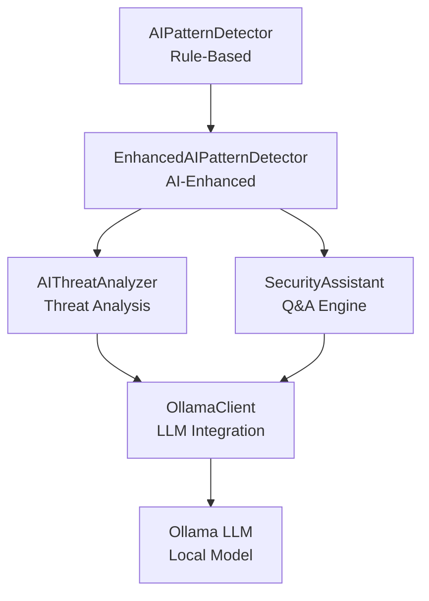

# AI Integration Guide - Ollama LLM Enhancement

## Overview

The AI Pattern Detector has been enhanced with local Ollama LLM integration to provide intelligent threat analysis, natural language explanations, and AI-powered security insights. This implements a "fighting AI with AI" capability while maintaining privacy through local model execution.

## Architecture



See [AI Workflow](./AI_WORKFLOW.md) for detailed workflow diagrams.

## Features

### 1. AI-Enhanced Threat Analysis

- **Context-aware pattern recognition**: LLM analyzes request sequences for subtle patterns beyond rule-based detection
- **Natural language explanations**: Converts technical detections into understandable explanations
- **Intent classification**: Classifies request intent (reconnaissance, enumeration, exploitation, etc.)
- **Attack scenario generation**: Generates realistic attack scenario descriptions

### 2. AI Security Assistant

- **Q&A capabilities**: Answers questions about threats, detection logic, and security
- **Security recommendations**: Provides prioritized, actionable security recommendations
- **Incident report generation**: Auto-generates professional incident reports
- **Detection logic explanation**: Explains how detection algorithms work

### 3. Enhanced Detection Engine

- **Combined detection**: Rule-based + AI-based detection for improved accuracy
- **False positive reduction**: AI helps reduce false positives by analyzing context
- **Dynamic threat scoring**: AI provides additional context for threat scoring
- **Natural language alerts**: Generates human-readable alert descriptions

## Installation

### Prerequisites

1. **Install Ollama**: Download and install Ollama from [https://ollama.ai](https://ollama.ai)

2. **Pull a model** (recommended: llama3):
```bash
ollama pull llama3
```

3. **Start Ollama server** (usually runs automatically):
```bash
ollama serve
```

### Python Dependencies

Install the required Python package:
```bash
pip install ollama
```

Or install all dependencies:
```bash
pip install -r ai_tools/requirements.txt
```

## Configuration

### Environment Variables

Set these environment variables to configure Ollama integration:

```bash
# Enable/disable Ollama AI features
OLLAMA_ENABLED=true

# Ollama server URL (default: http://localhost:11434)
OLLAMA_HOST=http://localhost:11434

# Model to use (default: llama3)
OLLAMA_MODEL=llama3

# Enable AI analysis (default: true)
AI_ANALYSIS_ENABLED=true

# Enable AI response caching (default: true)
AI_CACHE_ENABLED=true
```

### Configuration File

You can also configure these in `ai_tools/config.py`:

```python
OLLAMA_ENABLED = True
OLLAMA_HOST = "http://localhost:11434"
OLLAMA_MODEL = "llama3"
AI_ANALYSIS_ENABLED = True
AI_CACHE_ENABLED = True
```

## Usage

### Basic Usage

```python
from ai_tools.detection.enhanced_detector import EnhancedAIPatternDetector
from ai_tools.config import Config

# Initialize with AI enabled
config = Config()
detector = EnhancedAIPatternDetector(config=config, enable_ai=True)

# Analyze a request (AI enhancement happens automatically)
detection = detector.analyze_request(request)

# Get AI explanation
explanation = detector.get_threat_explanation(detection)
print(explanation)

# Get AI recommendations
recommendations = detector.get_ai_recommendations(detection)
for rec in recommendations:
    print(rec)
```

### Using AI Threat Analyzer Directly

```python
from ai_tools.ai_analysis.threat_analyzer import AIThreatAnalyzer
from ai_tools.config import Config

config = Config()
analyzer = AIThreatAnalyzer(config=config)

# Analyze a detection
ai_analysis = analyzer.analyze_detection(detection, request_history=recent_requests)

print(f"Explanation: {ai_analysis['explanation']}")
print(f"Intent: {ai_analysis['intent']}")
print(f"Recommendations: {ai_analysis['recommendations']}")
```

### Using Security Assistant

```python
from ai_tools.ai_analysis.security_assistant import SecurityAssistant
from ai_tools.config import Config

config = Config()
assistant = SecurityAssistant(config=config)

# Ask a question
answer = assistant.answer_question(
    "What is superhuman speed detection?",
    context={"threat_score": 75}
)

print(answer['answer'])
```

### Dashboard Integration

The Streamlit dashboard automatically integrates AI features:

1. **Enable AI Analysis**: Check the "Enable AI Analysis" checkbox in the sidebar
2. **View AI Insights**: Click "🤖 AI Insights" button on any alert
3. **Ask Security Assistant**: Use the "💬 Ask Security Assistant" expandable section
4. **View Recommendations**: AI recommendations appear automatically for malicious detections

## Architecture

### Components

1. **OllamaClient** (`ai_tools/ai_analysis/ollama_client.py`)
   - Wraps Ollama API for local LLM inference
   - Handles connection management and error handling
   - Provides caching and fallback mechanisms

2. **AIThreatAnalyzer** (`ai_tools/ai_analysis/threat_analyzer.py`)
   - Uses Ollama for enhanced threat analysis
   - Generates explanations, recommendations, and scenarios
   - Creates incident reports

3. **SecurityAssistant** (`ai_tools/ai_analysis/security_assistant.py`)
   - AI-powered security advisor
   - Answers questions about threats and security
   - Provides security recommendations

4. **EnhancedAIPatternDetector** (`ai_tools/detection/enhanced_detector.py`)
   - Extends base detector with AI analysis
   - Combines rule-based and AI-based detection
   - Provides AI-enhanced threat scoring

### Workflow

1. **Request Analysis**: Standard rule-based detection runs first
2. **AI Enhancement**: If threat detected and AI enabled, AI analysis is performed
3. **Threat Scoring**: AI analysis may adjust threat score based on intent classification
4. **Explanation Generation**: Natural language explanation is generated
5. **Recommendations**: Security recommendations are provided

## Best Practices

### Privacy & Security

- ✅ All processing happens locally (no data leaves environment)
- ✅ Optional feature (can disable if Ollama unavailable)
- ✅ Graceful degradation if Ollama fails
- ✅ No sensitive data in prompts

### Performance

- ✅ Caching for repeated analyses
- ✅ Configurable model selection (smaller models for speed)
- ✅ Batch processing for efficiency
- ✅ Non-blocking operations where possible

### User Experience

- ✅ Clear indicators when AI analysis is active
- ✅ Toggle to enable/disable AI features
- ✅ Loading states during AI processing
- ✅ Error messages if Ollama unavailable

## Troubleshooting

### Ollama Not Available

If you see "🔴 Unavailable" status:

1. **Check Ollama is installed**: `ollama --version`
2. **Check Ollama is running**: `curl http://localhost:11434/api/tags`
3. **Check model is pulled**: `ollama list`
4. **Check firewall**: Ensure port 11434 is accessible

### Slow Performance

- Use smaller models (e.g., `llama3:8b` instead of `llama3`)
- Enable caching: `AI_CACHE_ENABLED=true`
- Reduce AI analysis frequency (only analyze high-threat detections)

### Import Errors

If you get import errors for `ollama`:

```bash
pip install ollama
```

## Model Recommendations

### Recommended Models

- **llama3** (default): Good balance of speed and quality
- **llama3:8b**: Faster, smaller model
- **mistral**: Alternative model with good performance
- **codellama**: Better for code-related analysis

### Model Selection

```bash
# Pull a model
ollama pull llama3

# Set model in environment
export OLLAMA_MODEL=llama3
```

## Examples

### Example 1: Basic Detection with AI

```python
from ai_tools.detection.enhanced_detector import EnhancedAIPatternDetector
from ai_tools.utils.models import Request
from datetime import datetime

detector = EnhancedAIPatternDetector(enable_ai=True)

request = Request(
    timestamp=datetime.now(),
    ip_address="192.168.1.100",
    endpoint="/api/users/1",
    method="GET",
    user_agent="Mozilla/5.0"
)

detection = detector.analyze_request(request)

if detection.threat_level.value != "normal":
    print(f"Threat: {detection.pattern_type.value}")
    print(f"AI Explanation: {detector.get_threat_explanation(detection)}")
```

### Example 2: Generate Incident Report

```python
from ai_tools.ai_analysis.threat_analyzer import AIThreatAnalyzer
from ai_tools.config import Config

analyzer = AIThreatAnalyzer(config=Config())

# Get detections
detections = detector.detections[-10:]  # Last 10 detections

# Generate report
report = analyzer.generate_incident_report(detections)
print(report)
```

### Example 3: Security Q&A

```python
from ai_tools.ai_analysis.security_assistant import SecurityAssistant

assistant = SecurityAssistant()

questions = [
    "What is systematic enumeration?",
    "How does superhuman speed detection work?",
    "What should I do if I detect a behavioral anomaly?"
]

for question in questions:
    answer = assistant.answer_question(question)
    print(f"Q: {question}")
    print(f"A: {answer['answer']}\n")
```

## API Reference

See individual module documentation:

- `ai_tools/ai_analysis/ollama_client.py` - OllamaClient API
- `ai_tools/ai_analysis/threat_analyzer.py` - AIThreatAnalyzer API
- `ai_tools/ai_analysis/security_assistant.py` - SecurityAssistant API
- `ai_tools/detection/enhanced_detector.py` - EnhancedAIPatternDetector API

## Limitations

- Requires Ollama to be installed and running
- Model inference can be slower than rule-based detection
- Quality depends on model selection
- Local models may have limitations compared to cloud LLMs

## Future Enhancements

- RAG (Retrieval-Augmented Generation) for threat intelligence
- Multi-model ensemble for improved accuracy
- Fine-tuned models for cybersecurity domain
- Async processing for better performance
- Advanced caching strategies

