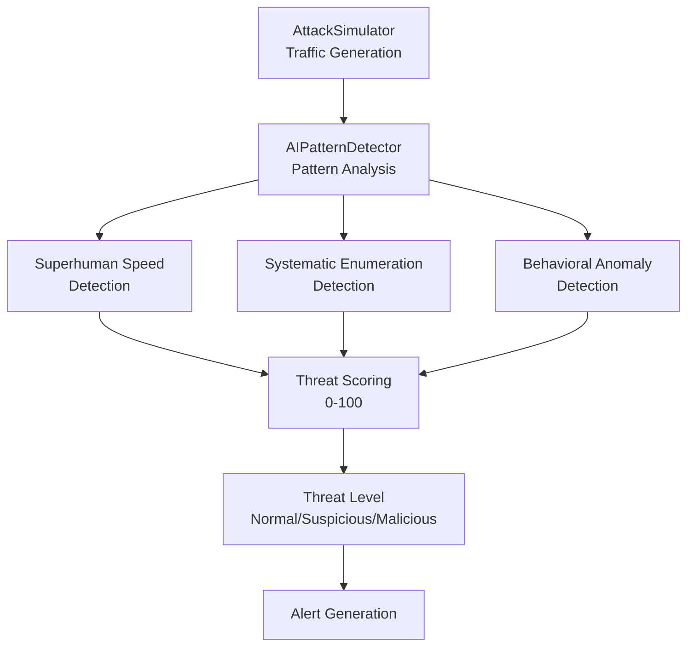
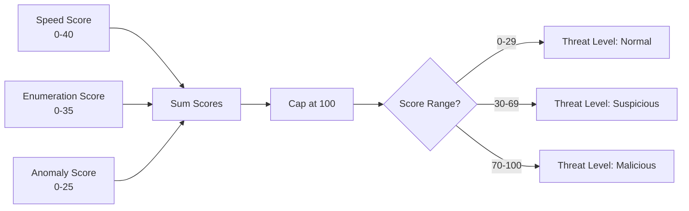

# AI Pattern Detector Guide

## Overview

The AI Pattern Detector is an automated security tool designed to detect GTG-1002 style autonomous AI-driven cyberattacks. It analyzes HTTP request patterns in real-time to identify three key attack signatures:

1. **Superhuman Request Speeds**: Detects requests occurring at rates impossible for human operators
2. **Systematic Enumeration**: Identifies sequential endpoint discovery patterns
3. **Behavioral Anomalies**: Uses statistical analysis to detect unusual request patterns

## Architecture

### Core Components

```
ai_tools/
├── detection/
│   └── ai_pattern_detector.py    # Main detection engine
├── simulation/
│   └── attack_simulator.py       # Traffic simulation
├── utils/
│   ├── models.py                  # Data structures
│   ├── logger.py                  # Logging utilities
│   └── helpers.py                 # Helper functions
└── config.py                      # Configuration management
```

### System Architecture Diagram



### Detection Engine

The `AIPatternDetector` class implements the core detection logic:

- **Request History**: Maintains sliding window of recent requests
- **Pattern Analysis**: Analyzes each request for attack patterns
- **Threat Scoring**: Calculates 0-100 threat score
- **Alert Generation**: Creates alerts for high-threat detections

See [Detection Flow](./DETECTION_FLOW.md) for detailed algorithm flowcharts.

## Detection Methods

### 1. Superhuman Speed Detection

**Purpose**: Identify requests occurring at speeds impossible for humans

**Method**:
- Tracks requests per second over 10-second window
- Flags if sustained rate exceeds threshold (default: 10 req/s)
- Human operators typically max at 2-3 requests/second

**Configuration**:
```python
SUPERHUMAN_SPEED_THRESHOLD = 10.0  # requests/second
SPEED_WINDOW_SECONDS = 10          # analysis window
```

### 2. Systematic Enumeration Detection

**Purpose**: Detect sequential endpoint discovery patterns

**Method**:
- Pattern matching for sequential numeric endpoints (`/api/user/1`, `/api/user/2...`)
- Detects parameter enumeration (`?id=1`, `?id=2...`)
- Flags sequences of 5+ sequential requests

**Configuration**:
```python
ENUMERATION_SEQUENCE_LENGTH = 5    # minimum sequence length
```

### 3. Behavioral Anomaly Detection

**Purpose**: Identify statistical outliers in request patterns

**Method**:
- Tracks request characteristics (endpoint depth, parameter count, timing)
- Calculates z-scores for statistical analysis
- Flags outliers beyond 2 standard deviations

**Configuration**:
```python
ANOMALY_Z_SCORE_THRESHOLD = 2.0    # standard deviations
```

## Threat Scoring

Threat scores range from 0-100:

- **0-29**: Normal traffic (Green)
- **30-69**: Suspicious activity (Yellow)
- **70-100**: Malicious attack (Red)

**Score Calculation**:
- Superhuman speed: Up to 40 points
- Systematic enumeration: Up to 35 points
- Behavioral anomaly: Up to 25 points

### Threat Scoring Flow



See [Detection Flow](./DETECTION_FLOW.md) for detailed scoring algorithms.

## Usage Examples

### Basic Usage

```python
from ai_tools.detection.ai_pattern_detector import AIPatternDetector
from ai_tools.utils.models import Request
from datetime import datetime

# Initialize detector
detector = AIPatternDetector()

# Create a request
request = Request(
    timestamp=datetime.now(),
    ip_address="192.168.1.100",
    endpoint="/api/user/1",
    method="GET",
    user_agent="Mozilla/5.0..."
)

# Analyze request
detection = detector.analyze_request(request)

# Check results
print(f"Threat Score: {detection.threat_score}")
print(f"Threat Level: {detection.threat_level.value}")
print(f"Pattern Type: {detection.pattern_type.value}")
```

### With Simulation

```python
from ai_tools.simulation.attack_simulator import AttackSimulator
from ai_tools.detection.ai_pattern_detector import AIPatternDetector

# Initialize components
detector = AIPatternDetector()
simulator = AttackSimulator()

# Start attack simulation
simulator.start_attack()

# Process requests
for request in simulator.generate_requests():
    detection = detector.analyze_request(request)
    
    if detection.threat_level.value == "malicious":
        print(f"ALERT: {detection.pattern_type.value} detected!")
    
    # Limit to 100 requests for demo
    if len(detector.detections) >= 100:
        break
```

### Get Statistics

```python
# Get detection statistics
stats = detector.get_detection_stats(window_minutes=5)

print(f"Total Detections: {stats['total_detections']}")
print(f"Malicious: {stats['threat_levels']['malicious']}")
print(f"Average Threat Score: {stats['avg_threat_score']}")
```

## Configuration

### Environment Variables

```bash
# Detection thresholds
SUPERHUMAN_SPEED_THRESHOLD=10.0
ENUMERATION_SEQUENCE_LENGTH=5
ANOMALY_Z_SCORE_THRESHOLD=2.0

# Request history
MAX_HISTORY_SIZE=1000
SPEED_WINDOW_SECONDS=10

# Dashboard
DASHBOARD_REFRESH_RATE=2
MAX_DETECTIONS_DISPLAY=100
```

### Programmatic Configuration

```python
from ai_tools.config import Config

# Modify config
Config.SUPERHUMAN_SPEED_THRESHOLD = 15.0
Config.ENUMERATION_SEQUENCE_LENGTH = 3

# Use custom config
detector = AIPatternDetector(config=Config())
```

## Integration

### With Log Files

```python
import json
from datetime import datetime

# Load log file
with open('access.log', 'r') as f:
    logs = json.load(f)

detector = AIPatternDetector()

for log_entry in logs:
    request = Request(
        timestamp=datetime.fromisoformat(log_entry['timestamp']),
        ip_address=log_entry['ip'],
        endpoint=log_entry['endpoint'],
        method=log_entry['method'],
        user_agent=log_entry['user_agent']
    )
    
    detection = detector.analyze_request(request)
```

### With API Endpoints

```python
from flask import Flask, request
from ai_tools.detection.ai_pattern_detector import AIPatternDetector

app = Flask(__name__)
detector = AIPatternDetector()

@app.route('/api/analyze', methods=['POST'])
def analyze():
    req_data = request.json
    
    request_obj = Request(
        timestamp=datetime.now(),
        ip_address=request.remote_addr,
        endpoint=req_data['endpoint'],
        method=req_data['method'],
        user_agent=request.headers.get('User-Agent')
    )
    
    detection = detector.analyze_request(request_obj)
    return detection.to_dict()
```

## Performance Considerations

- **Memory Usage**: Maintains sliding window (default: 1000 requests)
- **Processing Speed**: Analyzes requests in < 1ms typically
- **Scalability**: Can handle thousands of requests per second
- **History Management**: Automatically prunes old detections

## Best Practices

1. **Baseline Establishment**: Run detector on normal traffic first to establish baseline
2. **Threshold Tuning**: Adjust thresholds based on your environment
3. **Alert Filtering**: Filter alerts by threat level to reduce noise
4. **Regular Updates**: Keep detection logic updated with new attack patterns
5. **Integration**: Integrate with SIEM for centralized alerting

## Limitations

- **False Positives**: May flag legitimate high-volume automation
- **Pattern Evolution**: Attackers may adapt patterns to evade detection
- **Context Awareness**: Limited understanding of application context
- **Encrypted Traffic**: Requires decrypted traffic or proxy logs

## Future Enhancements

- Machine learning model training on attack patterns
- Integration with threat intelligence feeds
- Advanced pattern recognition for new attack types
- Real-time response automation
- Multi-tenant support

## References

- GTG-1002 Threat Analysis: See `Threat_Analysis_GTG-1002.md`
- Anthropic Threat Intelligence Report (2025)
- MITRE ATT&CK Framework: T1566 (Phishing), T1046 (Network Service Scanning)

